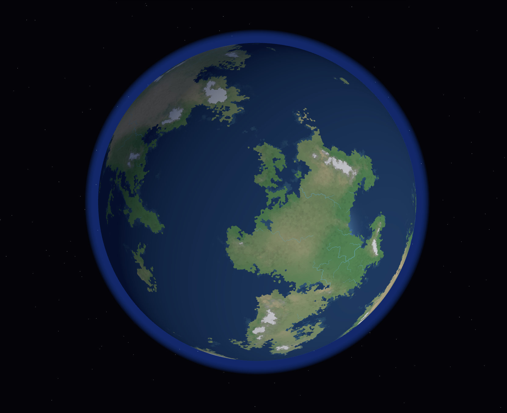

# Another Earth Generator

[English](./README.md) | [简体中文](./README.zh-CN.md)



An experimental project to generate procedural virtual planets in the browser. The same seed and parameters determine the spherical grid, tectonic plates, continents, terrain, seasonal climate, river networks, and biomes; the same spherical result can be viewed in both a 3D globe and a 2D map.

## What it can do now

- Adjust the seed, grid detail, tectonic plate and continent parameters, terrain strength, axial tilt, and temperature/precipitation parameters to regenerate the world.
- Switch between the globe and map to view satellite imagery, terrain, elevation, tectonic plates, geometric flow, monthly temperature and precipitation, winds, ocean currents, Köppen climate classification, and biomes.
- Overlay display elements like rivers, clouds, and graticules, and click on regions to inspect elevation, climate, and ecological information.

The generated result is an approximate model for visualization and procedural generation, not a quantitative forecast of the Earth system. Ocean current strength is a relative value; lakes, settlements, and social systems currently have no generation stages.

## Running locally

Requires Node.js and pnpm. In the project root directory, run:

```bash
pnpm install
pnpm dev
```

Open the local address provided in the terminal. Use `pnpm test` to run existing tests and `pnpm build` to create a production build.

## Where to start reading

Non-developers can start with the [Wiki Introduction](docs/wiki/README.md) to sequentially understand "Spherical Grid → Plates and Landmasses → Terrain → Seasonal Circulation and Climate → Rivers → Ecology → Visualization". Each chapter first explains the phenomena, then provides the algorithms, fields, and source code entry points.

Developers can first look at the [System Architecture](docs/wiki/01-system-architecture.md) and the [Worker Pipeline](src/core/simulation/worker/simulation.worker.ts). The core code is located in `src/core/`, and the user interface is in `src/ui/`.

Tech Stack: TypeScript, Vite, Svelte 5, Three.js, Tailwind CSS, Vitest. The project uses pnpm for dependency management.
