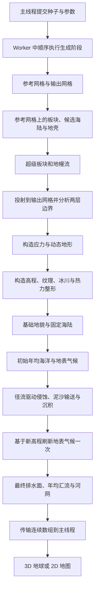

# 第 1 章 · 系统架构与球面地貌流水线

> **实现状态：**当前生成器已完成球面网格、板块与大陆、构造高程、地貌后处理、年均海洋与水汽输送、12 个月季节气候，以及径流驱动的水力侵蚀、守恒泥沙输送和年均河网。3D 地球和 2D 地图共享同一份生成结果；逐月水汽求解、正式湖泊、季节性河流、生态和人文地理仍是后续设计，见第 7～11 章。

## 1. 球面为唯一空间真源

区域中心、邻接、面积、构造属性和高程定义在球面网格上。3D 与 2D 视图读取同一份生成结果；地图投影只改变显示位置，不在平面上重新决定海陆或板块。大规模区域属性使用连续数组保存，网格拓扑和阶段结果分开组织。

## 2. 当前生成与显示流程

生成阶段由调度器按固定顺序执行，并在阶段开始时报告进度。主线程每次发起生成时重新创建 Worker；生成完成后，连续数组通过可转移缓冲区交付，主线程恢复网格对象的拓扑访问能力，再更新渲染。显示模式、经纬网、大气和相机等外观操作使用已有生成结果。

## 3. 阶段数据契约

| 阶段 | 主要输入 | 主要输出 |
| --- | --- | --- |
| 网格 | 种子、规则度、输出精度 | 固定参考网格、输出网格、区域映射 |
| 参考板块 | 参考网格、板块和大陆参数 | 细板块、候选海陆、大陆编号、地壳和修正后的运动 |
| 超级板块 | 参考板块及地壳 | 主构造单元、运动与参考地幔流 |
| 投射与边界 | 两层板块、区域映射、输出网格 | 输出区域属性、细板块与超级板块边界、混合应力 |
| 构造 | 地幔流与边界 | 动态地形、受地幔调制的构造场 |
| 基础地貌 | 候选海陆、构造场、地貌参数 | 物理高程与海陆、纹理、冰川和热力诊断场 |
| 初始年均与季节气候 | 基础地貌、海陆、球面邻接与纬度 | 风场、海盆、边流量、海温、年均与 12 个月气温、降水、潜在蒸散和径流 |
| 水力地貌演化 | 物理高程、初始年均径流、固定海陆 | 更新高程、累计侵蚀与沉积厚度、泥沙输送／输出／滞留及收支 |
| 气候反馈 | 更新高程、固定海陆、已有海洋数据 | 刷新年均与月度地表气候；复用海洋环流和海温 |
| 地表水文 | 最终高程、最终海陆、球面邻接、更新后的年均径流 | 无洼地排水高程、下游关系、拓扑顺序、年均流量、几何汇流、河流掩码与河级 |
| 显示 | 网格、地质与地理数据 | 专题颜色、几何、拾取信息 |

阶段运行时使用共享的临时上下文；对外的生成结果按**地质**、**地理**、**海洋**、**气候**与**水文**组织。地质数据包括板块、构造边界、火山和地幔场；地理数据包括候选海陆、最终海陆、基础与最终高程、地形分类、纹理、整形及侵蚀诊断，另以 `fluvialErosion` 保存累计水力侵蚀／沉积及泥沙体积收支；海洋数据包括海洋掩码、海盆、年均风场、共享边传输、海流、海表温度及沿岸上升流；气候数据包括年均与 12 个月气温、降水、潜在蒸散、径流和大陆度；水文数据包括排水高程、下游关系、拓扑顺序、汇流累积、物理年均流量（m³/s）、河流掩码、河级和入海出口标记。候选海陆是生成输入，最终海陆由基础地貌后处理后的高程决定，两者不能混用。公开高程和高程增量以千米表示；基础地貌内部使用形态坐标，在初始气候之前换算为 km。之后的水力地貌演化直接使用物理距离、面积与高程，并保持海陆身份。

## 4. 确定性与重算边界

相同种子和参数应生成相同结果。参考网格在同一 Worker 生命周期内可按种子与规则度复用，细板块可按相关参数复用；但当前主线程每次生成都会重新创建 Worker，因此跨生成请求**没有实际复用这些缓存**。修改地貌参数仍会触发完整生成流程；仅改变外观参数时，视图复用当前世界数据。

检查生成质量时，应依次核对球面网格连通、板块与候选大陆连通、面积加权的陆地覆盖率、构造带位置、跨分辨率的大尺度轮廓，以及种子重现性。后续气候和水文系统应从最终物理高程与最终海陆出发。

## 5. 阶段计时与计算复用

每次生成在控制台输出阶段耗时表（ms）：网格、板块、投射、构造、地貌、初始气候、水力地貌演化、气候反馈、最终水文，以及主线程的 `RestoreMesh`。另输出 `renderSetup` 和 `total`；渲染准备计时覆盖 CPU 几何构建，不包括后续 GPU 上传与首帧绘制。阶段计时也通过 `onStageComplete`、`onPipelineComplete` 中间件传递。

当前优化保持网格精度、侵蚀子步和气候收敛阈值：

- 同一次生成的初始气候与反馈共用求解器，复用固定风场的边通量、扩散系数、邻接布局和大陆度；地形滤波、抬升、温度与水汽损失仍重新计算。
- 反馈的实际场从初始气候的水汽／云水库存继续求解，库存复制后更新，仍检查相对变化与全球水量误差。无地形雨影参考场若已收敛，且海陆、海温、海平面基础气温与风场完全一致，则直接复用降水结果；尚未收敛或驱动变化时继续求解。更换网格、风场数组或原地修改风场时重新建立输运系数。热启动允许正常数值收敛差异，不保证与从零求解逐位一致。
- 水汽入流系数提前除以接收单元面积，固定损失分母、海洋补给和饱和容量项提前计算，减少每轮扫描的除法；海温的纬度平衡温度、月度的固定季节相位也只计算一次。仍使用原网格、迭代上限和水量门槛。
- 排水阶段以 `WeakMap` 缓存不可变网格的邻接与 Float64 大圆距离；每个侵蚀子步仍重建填洼面、下游图与流量，避免缓存旧流向。
- 正式流水线跳过基础地貌中的临时汇流与锐化后的排水诊断，由最终水文统一填充这些字段。
- 主线程直接恢复 Worker 传来的 Voronoi 连续数组，不重新做网格几何构建。共享边查找表延迟生成并存入局部 `WeakMap`，不随世界数据序列化传输。
- 生成完成后只初始化一次渲染几何与覆盖层，避免紧接着重复执行外观更新。

这些缓存只用于同一网格／同一次气候反馈；跨生成仍重新建立 Worker。后续是否持久化 Worker 或引入较粗的气候网格，应依据阶段实测，并同时处理缓存失效和转移缓冲区分离问题。

`AnnualClimate` 与 `ClimateFeedback` 另外输出内部计时表：`OceanCirculation`、`SeaSurfaceTemperature`、`Continentality`、`AirTemperature`、`MoistureTransport`、`ClimateTerrainFilter`、`MoistureActual`、`MoistureReference`、`AnnualRunoff`、`MonthlyClimate`。水汽行包含本次迭代次数与收敛状态，`reused=true` 表示使用缓存；参考场复用时本次迭代为 0，原收敛残差保留。未达到收敛门槛时输出实际变化量与水量残差，不能只凭阶段总耗时推断热启动有效。
