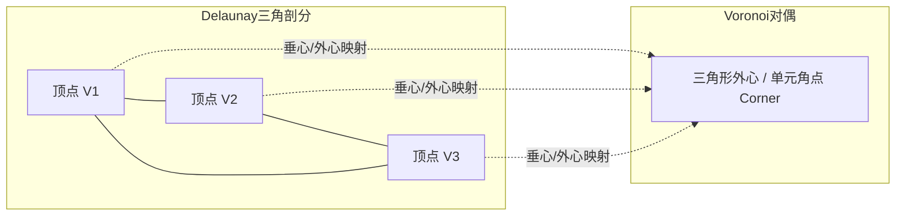

# 第 2 章 · 球面几何离散化与网格拓扑

本章深入探讨奇幻地图生成器的空间离散化基础：如何利用正二十面体细分（Icosphere）、切平面随机抖动（Jittering）与球面 Voronoi 剖分，在无边界的三维球面上构建均匀、各向同性且拓扑连续的离散空间网格。

---

## 1. 球面网格方案选型

在球面空间进行过程生成与物理模拟时，常见的网格剖分方案对比：

| 网格剖分方案 | 几何均匀性 | 极点奇异性 | 邻接关系 | 适用场景 |
| :--- | :--- | :--- | :--- | :--- |
| **经纬度规则网格 (Lat-Lon Grid)** | 极差（两极收缩为点） | 存在两极奇点 | 结构化 4 邻接 | 纹理烘焙、光栅化图像导出 |
| **立方体投影球面 (Cubed Sphere)** | 良好 | 8 个角点畸变 | 6 个面之间跨面索引复杂 | GPU 深度贴图采样 |
| **正二十面体细分 (Icosphere)** | **极佳（全局高均匀度）** | **无奇点**（仅 12 个 5 邻接点） | **天然适合无边界图遍历** | **核心世界模拟网格（本项目采用）** |
| **Fibonacci 点集 + Delaunay** | 优秀 | 无奇点 | 构网与邻接排序较耗时 | 局部非均匀点集采样 |

本项目选择 **细分正二十面体（Icosphere）及其对偶球面 Voronoi 网格** 作为整个世界生成的空间骨架。

---

## 2. 正二十面体细分 (Icosphere Construction)

### 2.1 基础二十面体（Base Icosahedron）

基于黄金分割比 $\phi = \frac{1 + \sqrt{5}}{2} \approx 1.6180339887$，正二十面体的 12 个初始顶点定义为 3 个互相垂直的正交矩形顶点，初始点被投影归一化到单位球面上：

$$(\pm 1, \pm \phi, 0), \quad (0, \pm 1, \pm \phi), \quad (\pm \phi, 0, \pm 1)$$

这 12 个基础顶点连接构成 20 个初始等边球面三角形面片。

### 2.2 递归细分与边中点归一化

每次细分迭代（Subdivision Level $N$），对当前三角形的每条边取中点并归一化投影到单位球面：

$$\mathbf{v}_{\text{mid}} = \frac{\mathbf{v}_1 + \mathbf{v}_2}{\|\mathbf{v}_1 + \mathbf{v}_2\|}$$

每个三角形被细分为 4 个子三角形。网格规模与细分等级 $N$ 的关系为：

| 细分等级 $N$ | 区域数 (Regions / 顶点数 $V$) | 球面三角形数 $F$ | 拓扑半边数 $E$ | 平均多边形边长 (km, 地球尺度) |
| :---: | :---: | :---: | :---: | :---: |
| **0** | 12 | 20 | 30 | ~7,000 km |
| **3** | 642 | 1,280 | 1,920 | ~900 km |
| **4** | 2,562 | 5,120 | 7,680 | ~450 km |
| **5** | 10,242 | 20,480 | 30,720 | ~225 km |
| **6** | 40,962 | 81,920 | 122,880 | ~110 km |

顶点数与面数满足欧拉示性数公式：$V - E + F = 2$。

---

## 3. 消除规则感的确定性切平面抖动 (Jittering)

正二十面体细分网格具有高度的晶格对称性，直接用于地形生成会导致山脉与海岸线呈现明显的三角形几何条纹。

为了消除人工规则感同时保持网格拓扑的连通性与凸多面体性质，系统在每个顶点处沿其**局部切平面**施加受限的确定性随机位移：

```text
               z (法向量 n = P)
               ▲
               │   u (切向量1)
               │  ↗
               │ /
               ┼──────► v (切向量2)
              /
             /
            P (网格顶点)
```

### 抖动算法流程：
1. **构造切平面正交基**：对单位法向量 $\mathbf{n} = \mathbf{P}$，选取不共线的参考向量 $\mathbf{a}$，求出切空间基底：
   $$\mathbf{u} = \frac{\mathbf{n} \times \mathbf{a}}{\|\mathbf{n} \times \mathbf{a}\|}, \quad \mathbf{v} = \mathbf{n} \times \mathbf{u}$$
2. **生成切向微小扰动**：利用哈希伪随机数发生器在局部切圆内生成极坐标位移 $(\Delta u, \Delta v)$，扰动幅度限制在平均边长的 $32\%$ 以内：
   $$\mathbf{P}' = \frac{\mathbf{P} + \Delta u \mathbf{u} + \Delta v \mathbf{v}}{\|\mathbf{P} + \Delta u \mathbf{u} + \Delta v \mathbf{v}\|}$$
3. **拓扑重构**：基于抖动后的点集重新计算球面 Delaunay 三角剖分，确保不存在自交或退化三角形。

---

## 4. 球面 Voronoi 图与对偶数据结构

通过对球面 Delaunay 三角剖分求对偶，即可得到以每个网格点为中心的 **球面 Voronoi 多边形单元（Cells / Regions）**。



### 4.1 外心计算与角点构造

每个 Delaunay 球面三角形 $(\mathbf{A}, \mathbf{B}, \mathbf{C})$ 对应 Voronoi 图的一个角点（Corner）。其外心通过三维叉积计算并归一化：

$$\mathbf{N}_{\text{circum}} = (\mathbf{B} - \mathbf{A}) \times (\mathbf{C} - \mathbf{A})$$

$$\mathbf{C}_{\text{corner}} = \operatorname{sign}(\mathbf{N}_{\text{circum}} \cdot \mathbf{A}) \frac{\mathbf{N}_{\text{circum}}}{\|\mathbf{N}_{\text{circum}}\|}$$

### 4.2 拓扑数据布局

拓扑关系采用高效的扁平数组结构进行存储：

```text
struct SphericalVoronoiData {
    cornerPosition:     FloatArray[numCorners * 3]  // 三维角点坐标 [x0, y0, z0, x1, y1, z1, ...]
    cellCornerOffsets:  IntArray[numRegions + 1]    // CSR 偏移索引
    cellCorners:        IntArray[totalCorners]      // 各多边形按环序排列的角点索引
    cellArea:           FloatArray[numRegions]      // 各多边形球面度面积
    edgeRegions:        IntArray[numEdges * 2]      // 各边左右相邻的两个区域索引
    edgeCorners:        IntArray[numEdges * 2]      // 各边两端的角点索引
}
```

---

## 5. 球面度量几何数学

在世界生成中，所有距离与面积计算必须严格遵循球面几何学公式。

### 5.1 大圆距离与球面夹角

对于两个三维单位球面向量 $\mathbf{u}, \mathbf{v} \in S^2$：
- **球面点积**：$\cos \theta = \mathbf{u} \cdot \mathbf{v} = u_x v_x + u_y v_y + u_z v_z$
- **角距离（弧度）**：
  $$\theta = \arccos(\operatorname{clamp}(\mathbf{u} \cdot \mathbf{v}, -1, 1))$$
- **大圆实际物理距离**：$D = R_{\text{planet}} \cdot \theta$

### 5.2 球面三角形面积（吉拉德定理 Girard's Theorem）

对于球面上任意三顶点 $\mathbf{A}, \mathbf{B}, \mathbf{C}$ 构成的球面三角形，其内角分别为 $\alpha, \beta, \gamma$。三角形的球面度面积（球面角亏）为：

$$\text{Area} = \alpha + \beta + \gamma - \pi$$

在笛卡尔坐标系下，利用 **范·奥斯特姆公式（L'Huilier / Oosterom Formula）** 直接通过三向量行列式与标量积求得：

$$\tan\left(\frac{\text{Area}}{2}\right) = \frac{|\mathbf{A} \cdot (\mathbf{B} \times \mathbf{C})|}{1 + \mathbf{A} \cdot \mathbf{B} + \mathbf{B} \cdot \mathbf{C} + \mathbf{C} \cdot \mathbf{A}}$$

每个 Voronoi 单元（Region）的面积，即为其分解为若干个围绕中心划分的球面微元三角形面积之和：

$$\text{RegionArea}_i = \sum_{k} \operatorname{SphericalArea}(\mathbf{P}_i, \mathbf{C}_k, \mathbf{C}_{k+1})$$

全局所有 Region 的面积总和严格等于整个单位球面的表面积：$\sum \text{Area}_i = 4\pi \approx 12.56637$。
