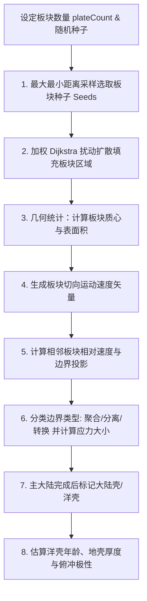

# 第 3 章 · 板块构造与地质应力动力学

板块构造（Plate Tectonics）是星球宏观地貌与地形骨架的决定性动力源。本章剖析奇幻地图生成器如何通过离散图算法与球面运动学模型，确定性地模拟岩石圈板块的划分、相对运动矢量场以及板块边界的应力分类。

---

## 1. 地质学模型背景

在地球物理学中，岩石圈由若干个刚性板块组成。板块在地幔热对流的驱动下在球面表面作相对运动。板块相互作用主要集中在边界区域：

```text
  1. 聚合型边界 (Convergent)      2. 分离型边界 (Divergent)      3. 转换断层边界 (Transform)
   ─────►         ◄─────         ◄─────         ─────►          ▲              │
  板块 A          板块 B         板块 A          板块 B         │ 板块 A        ▼ 板块 B
 碰撞造山带 / 俯冲带海沟         大洋中脊 / 裂谷带             走滑断层 / 剪切带
```

---

## 2. 板块生成流水线

板块生成的总体流程如下：



---

## 3. 板块种子选取：球面最大最小距离采样

为了使板块分布均匀且具有自然的多样性，种子选取不采用纯均匀随机分布，而是使用类似 **泊松盘采样（Poisson Disk Sampling）** 的最大最小点积距离策略：

1. 随机选取第 1 个种子节点 $S_0$；
2. 对于后续第 $k$ 个种子，维护所有候选单元到已有最近种子的球面夹角余弦最大值（即最近角距离最小值）：
   $$\operatorname{Score}(r) = \max_{j < k} (\mathbf{P}_r \cdot \mathbf{P}_{S_j})$$
3. 从点积得分最小（即离所有已有种子最远）的一批候选节点中加权随机挑选下一个种子 $S_k$。

这保证了各个板块种子在球面上均匀离散分布，避免产生过于碎小的微型板块。

---

## 4. 加权 Dijkstra 图扩散算法

板块的扩张模拟了地幔柱向四周推挤的过程。如果采用简单的 BFS（广度优先搜索），板块边界将呈现规则的同心圆多边形。

系统使用 **带确定性边权扰动的加权 Dijkstra 算法**（利用优先队列）：

```python
# 边权成本计算伪代码
function CalculateEdgeCost(currentRegion, neighborRegion, plateId, seed):
    # 结合两端节点索引生成确定性扰动因子 (0.72 ~ 1.28)
    variation = 0.72 + DeterministicHash(seed, currentRegion, neighborRegion, plateId) * 0.56
    edgeLength = DistanceBetweenRegions(currentRegion, neighborRegion)
    return edgeLength * variation
```

- **拓扑边长**：$D(\mathbf{u}, \mathbf{v}) = \arccos(\mathbf{u} \cdot \mathbf{v})$；
- **哈希随机扰动**：利用两端节点编号的组合哈希生成 $0.72 \sim 1.28$ 的波动因子；
- **各向异性生长**：使得各板块交界处呈现出自然蜿蜒、参差不齐的锯齿状地貌线。

---

## 5. 球面刚体运动学与欧拉旋转

每个板块被视作一个在球面上滑移的二维刚体。根据欧拉旋转定理，球面上任意刚体板块的瞬时运动可唯一表示为绕某条穿过地心的 **欧拉旋转轴（Euler Pole）** 的角旋转。

### 5.1 板块质心计算
板块 $P$ 覆盖的所有单元中心向量按其面积加权平均，并归一化：

$$\mathbf{C}_{\text{plate}} = \frac{\sum_{i \in P} \text{Area}_i \cdot \mathbf{P}_i}{\left\|\sum_{i \in P} \text{Area}_i \cdot \mathbf{P}_i\right\|}$$

### 5.2 欧拉极角速度场
每个板块保存一个三维欧拉角速度向量 $\boldsymbol{\omega}$。板块内任意球面位置 $\mathbf{P}$ 的瞬时刚体速度由叉积唯一确定：

$$\mathbf{v}_{\text{motion}}(\mathbf{P}) = \boldsymbol{\omega} \times \mathbf{P}$$

这保证同一板块在全球任意位置都属于同一个球面刚体旋转，而不是把质心处的切向速度当作全板块常量。系统只持久化权威运动参数 `plateAngularVelocity`；任意位置的切向速度均按需由叉积计算。

---

## 6. 边界动力学分类与应力场计算

对于两相邻单元 $A \in \text{Plate}_1$ 与 $B \in \text{Plate}_2$（$\text{Plate}_1 \neq \text{Plate}_2$），边界单位法向量指向从 $A$ 到 $B$：

$$\mathbf{n}_{\text{boundary}} = \frac{\mathbf{P}_B - \mathbf{P}_A}{\|\mathbf{P}_B - \mathbf{P}_A\|}$$

两板块在边界处的 **相对运动矢量** 为：

$$\mathbf{v}_{\text{rel}} = \mathbf{v}_{\text{motion}}(B) - \mathbf{v}_{\text{motion}}(A)$$

### 6.1 应力分解与边界分类

将相对运动矢量投影到边界法向：

$$\text{NormalVelocity} = \mathbf{v}_{\text{rel}} \cdot \mathbf{n}_{\text{boundary}}$$

```python
# 边界分类判定逻辑伪代码
if normalVelocity < -BOUNDARY_THRESHOLD:
    # 1. 聚合型边界 (Convergent) -> 挤压应力，形成褶皱山脉或海沟
    boundaryType = BoundaryType.Convergent
    stress = abs(normalVelocity)
elif normalVelocity > BOUNDARY_THRESHOLD:
    # 2. 分离型边界 (Divergent) -> 张裂应力，形成大洋中脊或裂谷
    boundaryType = BoundaryType.Divergent
    stress = normalVelocity
else:
    # 3. 转换型边界 (Transform) -> 剪切滑动
    boundaryType = BoundaryType.Transform
    stress = length(tangentialVelocity)
```

```text
 聚合边界 (Convergent)  ──► 挤压隆起  ──► 塑造高大山脉 / 火山岛弧 / 海沟
 分离边界 (Divergent)   ──► 张裂陷落  ──► 塑造大洋中脊 / 裂谷断陷盆地
 转换边界 (Transform)   ──► 剪切滑动  ──► 塑造断裂带与横向错断地貌
```

边界分类首先按“板块对 + 连通分量”建立边界段，并沿段平滑法向、切向速度。汇聚和张裂使用进入/退出双阈值进行滞回分类，过短的方向性片段降级为转换边界，避免分类在相邻单元间反复跳变。结果写入与球面 Voronoi 共享边一一对应的 `edgeBoundaryType`、`edgeBoundarySegment`、`edgeNormalVelocity`、`edgeShearVelocity` 与 `edgeStress`。区域级 `regionBoundaryType` 和 `regionStress` 仅聚合最强相邻边，供旧的区域消费者和概览着色使用。

`edgeBoundaryActivity` 是独立于物理应力的地貌表达包络。它在每个最终边界段上使用确定性的多尺度连续噪声生成，并在开放边界段端部与三联点附近渐弱，使同一条海脊或海沟自然出现强弱和宽度变化。该字段目前只调制海洋构造地貌，不改变洋壳年龄源，也不削弱陆地造山带。

---

## 7. 地壳类型、年龄与俯冲极性

主大陆生长完成后，系统把主大陆覆盖区视为大陆壳，其余区域视为洋壳；大陆碎片生成后再晋升为大陆壳。由此得到逐区域的 `regionCrustType`，并按球面单元面积统计每个板块的 `plateContinentalFraction`。

洋壳年龄以分离边界上的洋壳单元为零年龄源，通过限制在洋壳内的球面多源 Dijkstra 计算距洋中脊的角距离：

$$
\operatorname{OceanAge}(r)=\operatorname{clamp}\left(\frac{d_{\text{ridge}}(r)}{0.78},0,1\right)
$$

年龄较老的洋壳略厚但因冷却收缩而沉降更深。大陆壳厚度则由距大陆边缘的内部距离估算：大陆边缘约 $28\text{km}$，古老大陆内部可增厚至约 $40\text{km}$。对应字段为 `regionCrustAge` 与 `regionCrustThicknessKm`。

聚合边界的 `edgeSubductionPolarity` 按整段两侧的地壳性质确定：

- 洋陆汇聚：洋壳侧俯冲，大陆壳侧为上盘；
- 洋洋汇聚：较老、较冷的洋壳俯冲；
- 陆陆碰撞：不指定俯冲极性，两侧共同参与碰撞造山。

同一汇聚段只选择一块下沉板块，局部大陆壳单元不会临时反转俯冲方向。这一极性随后同时约束火山岛弧位置和高程剖面：岛弧与造山抬升位于上盘，深海沟只位于下盘，避免在一条汇聚边界两侧对称地产生山脉和海沟。
