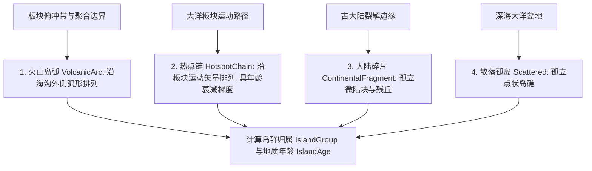

# 第 4 章 · 大陆核与岛弧岛屿生成机制

大陆（Continents）与岛屿（Islands）构成了星球的地表宏观格局。本章详细解析奇幻地图生成器如何结合板块构造动力学，模拟克拉通陆核（Cratons）的形成、沿构造走向的主轴各向异性拉伸、海岸线分形侵蚀以及火山岛弧与大洋热点岛链的生成机制。

---

## 1. 地学成因与分类体系

在地球演化史上，陆地分为两类主要的形成机制：
1. **陆块与大陆（Mainlands & Continents）**：由古老而稳定的克拉通（Cratons）陆核经过长期的陆块拼合与板块挤压碰撞扩张形成，通常具有广阔的陆体腹地与深厚的地壳；
2. **岛屿与群岛（Islands & Archipelagos）**：
   - **火山岛弧（Volcanic Island Arcs）**：在板块俯冲带边缘（如西太平洋岛弧），洋壳俯冲熔融形成弧形排列的火山群岛；
   - **大洋热点岛链（Hotspot Chains）**：大洋板块在地幔热柱上方移动（如夏威夷群岛），形成串珠状岛屿；
   - **大陆边缘离岛（Continental Islands）**：大陆边缘断裂侵蚀形成的近海岛屿。

```text
 ┌─────────────────────────────────────────────────────────────┐
 │                      总陆地面积配额 Target Area              │
 └──────────────┬──────────────────────────────┬───────────────┘
                │ (1 - islandLandShare)        │ islandLandShare
                ▼                              ▼
 ┌─────────────────────────────┐ ┌─────────────────────────────┐
 │   主大陆生成 Mainland Gen   │ │    岛屿体系生成 Island Gen  │
 │  - 克拉通陆核种子           │ │  - 俯冲带弧形火山岛         │
 │  - 沿板块走向各向异性拉伸   │ │  - 大洋热点链群岛           │
 │  - 3D Simplex 海岸线侵蚀    │ │  - 近海碎屑副岛             │
 └─────────────────────────────┘ └─────────────────────────────┘
```

---

## 2. 陆地面积配额与多态性分配

给定全球总面积 $A_{\text{globe}} = 4\pi$ 与陆地覆盖率参数 `landCoverage`（$5\% \sim 85\%$）：

$$A_{\text{total\_land}} = A_{\text{globe}} \cdot \operatorname{clamp}(\text{landCoverage}, 0.05, 0.85)$$

$$A_{\text{mainland\_target}} = A_{\text{total\_land}} \cdot (1 - \text{islandLandShare})$$

### 大陆面积的幂律多态性分配
若设定大陆数量为 $K$ 个，系统通过指数衰减分配各个大陆的目标面积配额：

$$w_i = \exp\left( -2.2 \cdot \text{sizeVariety} \cdot \frac{i}{K} \right) \cdot (1 \pm 0.25 \cdot \text{rnd})$$

$$A_i = A_{\text{mainland\_target}} \cdot \frac{w_i}{\sum_{j=1}^K w_j}$$

- 当 `sizeVariety = 0` 时，各大洲面积均等；
- 当 `sizeVariety = 1` 时，形成类似“亚欧非超级超大陆 + 美洲次大陆 + 澳洲小大陆”的显著大小层级结构。

---

## 3. 大陆核生长与各向异性拉伸

真实的大陆形状并非正圆形，而是受到板块运动方向推挤与拉伸。

```text
                 北向基底基底 n
                     ▲
                     │     主拉伸轴 Axis (长轴 a)
                     │    ↗
                     │  /
                     ┼────────► 东向基底 e
                    /
                   /
           陆核种子 Seed (短轴 b)
```

### 3.1 椭球切平面投影距离度量
为每个大陆种子分配主拉伸方向 $\mathbf{d}_{\text{axis}}$ 与长宽比 $\rho \in [1.2, 2.8]$。在图搜索（Dijkstra）扩展时，两节点间的有效度量不仅考虑大圆弧长，还叠加了椭圆切空间投影距离：

$$u = (\mathbf{P} - \mathbf{P}_{\text{seed}}) \cdot \mathbf{e}_{\text{east}}, \quad v = (\mathbf{P} - \mathbf{P}_{\text{seed}}) \cdot \mathbf{e}_{\text{north}}$$

$$\text{EllipticFactor} = \sqrt{\left(\frac{u_{\parallel}}{a}\right)^2 + \left(\frac{u_{\perp}}{b}\right)^2}$$

主轴不再独立随机采样，而是取大陆种子处的局部欧拉速度 $\boldsymbol{\omega}\times\mathbf{P}_{\text{seed}}$ 在切平面上的方向，并加入有限角度扰动。这驱动大陆优先沿板块运动走向延伸；多个大陆的前缘允许相邻接触但不会互相覆盖，因此可形成碰撞接合带和狭窄地峡，而不会被强制保留一圈海水隔离。

### 3.2 3D 分形噪声海岸侵蚀
在大陆向外扩张的前沿节点，系统利用连续的 3D 分形噪声函数调制生长阻力成本：

$$\text{Cost}_{\text{growth}} = \text{Distance} \cdot \left[ 1.0 + 0.45 \cdot \operatorname{Noise3D}(f \cdot x, f \cdot y, f \cdot z) \right]$$

这使得大陆海岸线自然凹凸不平，形成海湾、半岛、溺谷与岬角。

---

## 4. 岛屿成因分类体系与地质年龄演化

当主大陆生长达到目标配额后，剩余的 `islandLandShare` 面积将由岛屿生成模块接管。

主大陆完成与岛屿选址之间会先执行一次地壳建模，确定大陆壳/洋壳、洋壳年龄和汇聚边界俯冲极性。这样岛屿生成使用的是边级构造真源，而不是区域级“最强边界类型”的近似结果。

岛群到大陆海岸、汇聚边界和分离边界的距离使用带球面边长权重的多源 Dijkstra，以中央角弧度表示。原 subdivision-6 下的调校宽度通过参考单元角尺度换算，因此切换网格细分等级不会改变岛弧离海沟或大陆碎片离岸的实际球面尺度。

系统将岛屿严格划分为 4 类地质成因模型（Island Archetypes），并为每个岛屿单元计算相对地质演化年龄 $\text{Age} \in [0, 1]$：



### 4.1 4 类岛屿成因模型

| 岛屿类型 ID | 英文名称 | 地质构造背景与几何分布 | 地形与生态特征 |
| :---: | :--- | :--- | :--- |
| **1** | **火山岛弧 (VolcanicArc)** | 只在俯冲上盘一侧选址，并沿最近俯冲边界切线形成弧形排列（如阿留申群岛、日本列岛） | 坡度陡峭，火山锥高耸，地质年龄相对年轻 |
| **2** | **热点岛链 (HotspotChain)** | 洋底地幔热柱固定喷发，岛链限制在同一板块并沿局部欧拉速度方向排列（如夏威夷群岛） | 头部岛屿高耸年轻，尾部老岛受侵蚀和热沉降成为低平环礁或海山 |
| **3** | **大陆碎片 (ContinentalFragment)** | 优先分布在大陆近海与分离边界附近的微型陆块（如马达加斯加、新西兰） | 晋升为较厚的大陆地壳并保留平缓残丘 |
| **4** | **散落孤岛 (Scattered)** | 大洋盆地随机涌出的小型玄武岩火山岛或珊瑚礁 | 面积微小，地势低平 |

### 4.2 岛屿地质演化年龄（Island Age Gradient）
对于热点链（HotspotChain）等定序岛群，岛屿单元赋予沿着主轴方向单调递增的地质年龄：

$$\text{IslandAge}(r) = \operatorname{clamp}\left( \frac{\text{DistanceAlongTrack}}{\text{ChainLength}}, \, 0.0, \, 1.0 \right)$$

- $\text{Age} \approx 0.0$：**初生火山岛**，火山活动剧烈，山体极高，地表未充分风化；
- $\text{Age} \to 1.0$：**风化侵蚀老岛**，经历数千万年雨水剥蚀与重力沉降，高度逐渐降低，形成低洼环礁（Atoll）甚至没入水下。

热点链的成员顺序同时控制空间位置和年龄：第一个成员位于当前热点喷发端，后续成员沿板块运动方向依次变老。高程阶段除衰减火山起伏外，还施加随年龄非线性增加的沉降量，因此老岛可以越过面积平衡海平面而自然转为海山。

---

## 5. 核心输出数据结构

大陆与岛屿生成器首先输出地壳形态候选；物理高程生成器按面积加权海平面得到最终 `landMask` 后，再通过连通陆地传播修正大陆和岛群元数据。完全新露出的独立陆块会获得新的散落岛组，而被淹没的单元会清除原归属。

| 属性名称 | 类型说明 | 物理含义 | 下游用途 |
| :--- | :--- | :--- | :--- |
| `landMask` | 字节数组 `ByteArray[N]` | 全球陆地掩码（`1`: 陆地, `0`: 海洋） | 驱动高程生成、气候海陆热力场 |
| `regionContinent` | 整数数组 `IntArray[N]` | 陆地单元所属的大陆 ID（`-1`: 水域） | 区分各大洲、地缘政治与大陆命名 |
| `regionIslandType` | 字节数组 `ByteArray[N]` | 岛屿地质成因分类（`0`: 主大陆/无, `1~4`: 岛屿类型） | 调节微观地貌高程起伏与火山特征 |
| `regionIslandGroup` | 整数数组 `IntArray[N]` | 所属岛群/群岛唯一 ID（`-1`: 主大陆或海洋） | 驱动岛屿地缘群系与聚落跨海跳岛连接 |
| `regionIslandAge` | 浮点数组 `FloatArray[N]` | 相对地质演化年龄（`0.0`: 年轻, `1.0`: 衰老） | 衰减岛屿地形高程与侵蚀风化程度 |
