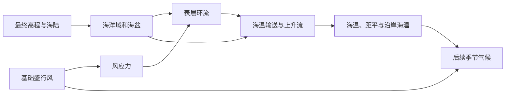

# 第 6 章 · 风生大洋环流与海表温度传输

> **实现状态：**当前已接入确定性的**年均、风驱动表层近似**，生成海洋域、海盆、风场、守恒边流量、海温、海温距平和沿岸上升流，供第 7 章气候系统使用。它不是三维海洋环流或海冰模型；西边界强化目前采用轻量化环流近似。

## 1. 物理依据与模型边界

信风、西风和高纬东风向海面施加风应力。科里奥利效应使表层漂流和整层 Ekman 输送偏转；风应力旋度、地转平衡、纬度变化与洋盆边界共同塑造大尺度环流。副热带环流通常在北半球顺时针、南半球逆时针；狭窄而强的西边界流不能仅靠沿岸滑动产生。赤道附近、极地及不被陆地截断的环南极海域需要与封闭的中纬洋盆区别处理。

**流向、流速、温度是不同的量。**“暖流”指输送较暖水体的流动，不等同于某处海温距平为正。冷海温还可能来自沿岸上升流。海温影响邻近大气的热量与水汽交换，但某个海岸是否温暖、多雨或干旱，还取决于季节、风向和大气环流，不能只由海温距平决定。

本章将年均表层环流视为较薄海洋混合层的水平流动，暂不求盐度、深层翻转、潮汐和动态海冰。地貌阶段完成后的**最终海陆与高程**是海洋域的输入；候选海陆不能作为海岸边界。

## 2. 与气候系统的依赖关系

第 7 章已实现年均水汽与云水平流，以及与陆地径流一致的实际蒸散回输；逐月水汽输送与双向海气热量反馈尚未实现。两章复用解析盛行风场：用纬度带给出信风、中纬西风和高纬东风，并在球面局部切平面表示风向。当前第六章仍使用年均值；第七章在年均场上派生 12 个月陆地与海洋温度、降水和径流，后续增加季节性海气反馈时仍沿用同一风场基础。



风应力可从局部风矢量 $\mathbf W$ 估算为 $\boldsymbol\tau=\rho_{\rm air}C_D|\mathbf W|\mathbf W$。这里的风向和海流均为球面切向量。首版可固定大气密度与阻力系数，将流速标定集中在海洋模型中；不应把“按纬度旋转风向一个固定角度”当成完整洋流解。

## 3. 海洋域与计算尺度

1. 在最终输出网格上标记海洋单元，按海洋邻接关系区分开放海盆、边缘海和封闭低洼水体。封闭低洼水体留给第 8 章湖泊模型；不同海盆之间不得隔陆传输水量或热量。
2. 年均首版直接在最终输出网格上求解，避免把最终海陆重新投影到另一套海岸线。海洋连通分量作为海盆编号，所有共享边输送只在同一海盆的海洋单元之间开放；狭窄海峡是否连通由输出网格本身的邻接关系决定。
3. 高分辨率粗化与回映射暂留给后续优化。引入粗网格时，海洋占比必须从**最终**输出海陆按面积聚合，并且回映射要按最终海陆掩码和海盆编号过滤，不能跨半岛或地峡混合海温。

球面区域面积原本是单位球面积。若以米每秒、平方米和秒计算输送，需要另设**物理行星半径**，用它换算区域面积、共享边长度与大圆距离。图形显示所用的球体半径不能直接充当物理千米尺度。

## 4. 表层洋流：从风应力到守恒的边流量

### 4.1 洋盆内的大尺度环流

年均首版暂不求解 Stommel／Sverdrup 流函数，而是把纬度带风场按半球科里奥利方向旋转，再叠加海盆尺度的环流偏置，得到候选表层速度。这个速度只作为共享边流量的动力先验；真正用于海温输送的量是经过海盆约束和散度校正后的边传输。后续再把风应力旋度、$\beta$ 效应和西边界强化替换进同一边流量接口。

风驱动分量在北半球右偏、南半球左偏。项目采用 $x=\cos\phi\cos\lambda, y=\sin\phi, z=\cos\phi\sin\lambda$ 的坐标嵌入，因此 `east × north = -radial`；东西／南北分量的旋转、Ekman 叉积和海盆旋转都按这个基底处理。例如北半球向东风的风驱动海流偏南，整层 Ekman 输送也向南；赤道处不指定半球偏转。

该近似在赤道附近不适用，应为赤道带设置独立的东西向流与上升流规则，避免含科里奥利参数倒数的公式在赤道发散。存在完整环绕通道的高纬海域也应单独允许绕极环流；不能把它强行当作四周封闭的洋盆。第一版优先保证主要副热带环流与海岸流的连贯性，不要求解析涡旋和全部边缘海动力学。

### 4.2 共享边传输与海岸约束

区域中心流速适合显示，**共享边的有向体积流量**才是海温输送的权威量。由流函数和表层贡献构建两相邻海洋区域之间的边流量；陆海边及不可通行海峡的流量为零。若数值近似造成单元流入与流出不平衡，应在海洋图上作散度校正，再计算温度。

```text
风场 → 风应力旋度 → 各海盆流函数 → 共享边候选流量
     → 海岸封闭与海盆约束 → 流量平衡校正 → 区域显示流速
```

单纯把撞岸速度投影到海岸切线，再做邻域平滑，虽然能改善局部外观，却不能保证流量守恒，也不会自动产生西边界强化。因此它只可用于显示方向的平滑，不能代替边流量求解。

当前用固定 4 轮 Jacobi 压力势投影近似修正边流量，边导通系数为 $LH/d$。该方法以固定且较低的工作量减少局部散度，不保证高分辨率网格上的严格无散；未达诊断阈值时仍继续生成。`transportDiagnostics` 保存轮数、阈值状态和相对残差；边流量使用 Float32。这里优先保证生成速度，严格流量守恒留待需要时再采用更昂贵的求解。

### 4.3 沿岸上升流

风驱动的表层水离岸输送时，可用较冷的次表层水补充沿岸混合层。第一版根据沿岸风应力、半球、海岸方向和离岸 Ekman 输送估计**上升流强度**；仅在与开放海洋连通、且风向条件合适的海岸施加冷却。该冷却是海温方程中的独立项，不通过改变海流方向或任意给东岸降低温度实现。

## 5. 海表温度：守恒输送与海气交换

### 5.1 纬度气候态基线

没有洋流时，可先用经验纬度曲线作为海气交换趋近的目标：

$$T_{\rm eq}(\phi)=T_{\rm pole}+(T_{\rm equator}-T_{\rm pole})\cos^p(|\phi|)$$

其中 $T_{\rm equator}$ 可从约 $27^\circ\mathrm C$ 起步，$T_{\rm pole}$ 可从约 $-1.8^\circ\mathrm C$ 起步，指数 $p$ 需要根据生成世界的气候外观校准。这是**经验气候态**，不是由辐射收支推导出的绝热平衡温度。原方案的 $28.5\cos^{0.85}(\phi)-2.5$ 在极点给出 $-2.5^\circ\mathrm C$，与其声称的海水冰点不一致，因此不再作为默认公式。

### 5.2 有限体积热量更新

把每个海洋区域视为面积 $A_i$（$\mathrm{m^2}$）、有效混合层厚度 $H$（$\mathrm m$）的水体。跨共享边的体积流量 $Q$（$\mathrm{m^3/s}$）将**上游单元的温度**带向下游；相邻海水之间还可进行对称扩散。两端对同一条边使用大小相同、符号相反的热通量，避免热量凭空产生。海气交换使温度以时间尺度 $\tau$ 向 $T_{\rm eq}$ 靠近，上升流则使沿岸表层温度向次表层温度靠近：

$$
T_i^{\rm new}=T_i+\frac{\Delta t}{H A_i}
\left[\sum_{e\in\rm inflow}Q_eT_{\rm up(e)}
-\sum_{e\in\rm outflow}Q_eT_i
+\sum_{j\in N(i)}K_{ij}(T_j-T_i)\right]
+\frac{\Delta t}{\tau}(T_{\rm eq,i}-T_i)
+\Delta t\,U_i(T_{\rm deep,i}-T_i).
$$

$K_{ij}$ 是对称的边扩散系数（$\mathrm{m^3/s}$），$U_i$ 是非负上升流混合率（$\mathrm{s^{-1}}$）。当前海温采用固定 6 轮更新，并按最大出流率对输送和扩散统一缩放，使工作量不随网格稳定步长增长。它保留海流方向、上游携热、扩散、海气弛豫和上升流冷却的影响，但只是快速视觉近似，不代表推进了完整的 720 天物理时间，也不保证达到稳态。内部温度计算中的更新仍采用固定 30 天系数；跨分辨率结果受空间离散与缩放近似影响。

每轮固定扫描共享边并同步更新温度；相比按稳定时间步完整积分，这显著限制了高分辨率网格的计算量，但牺牲热量输运的数值精度。

首版不模拟海冰形成与潜热，开放海面的温度受约 $-1.8^\circ\mathrm C$ 的海水冰点下限约束，并设置 $35^\circ\mathrm C$ 上限防止数值发散；后续应把触及冰点的区域作为诊断字段。专题色标仍可单独限制显示范围。

### 5.3 海温距平

$$\Delta T_{\rm SST}(i)=T_{\rm SST}(i)-T_{\rm eq}(\phi_i).$$

正距平代表比本地纬度基线暖，负距平代表更冷；两者都**不是流向分类**。应同时查看流速、海温和上升流强度，才能区分向极输热、向赤道输送冷水及局地上升流。

## 6. 输出与后续气候耦合

建议输出海洋掩码、海盆编号、东西／南北向表层流速、海温、海温距平和上升流强度；求解时使用的边流量可作为内部诊断保留。非海洋区域由掩码区分，不把陆地零值误读为 $0^\circ\mathrm C$ 海温。

第 7 章应读取沿岸海温和基础风场，再计算海气热量交换、水汽输送及陆地温度。沿岸影响应随**向岸风和季节**进入大气场，再传播到陆地；固定“向内陆扩散 2～3 层”的规则只能作为临时显示近似，不能直接决定降水或沙漠。当前月度气候仍复用年均海温和风场，后续若扩展月度海温气候态，应保持相同的海盆与守恒约束。

## 7. 分阶段实现与验收

1. **风与海洋域：**已生成最终海陆上的年均风场和海盆编号；后续粗网格优化仍需检查海峡开闭及不同精度的轮廓稳定性。
2. **环流：**已生成候选表层速度、同海盆共享边传输、散度校正和沿岸上升流；后续再加入赤道专用流、绕极通道和显式西边界强化。
3. **海温：**已加入面积体积换算、迎风输送、对称扩散、海气弛豫和上升流冷却，并施加海水冰点下限；后续需要做时间步长和能量守恒诊断。
4. **显示与接口：**已提供海温、海温距平、气温、降水和径流图层，并把同一海盆的边传输结果交给年均气候阶段；跨分辨率验证和更完整的流向图层留待后续。

## 参考依据

- [MIT 风生环流与西边界强化讲义](https://ocw.mit.edu/courses/12-808-introduction-to-observational-physical-oceanography-fall-2004/f3453f137faf7b071443bf853584cd3e_course_notes_5.pdf)
- [NOAA 海洋边界流说明](https://oceanservice.noaa.gov/education/tutorial_currents/04currents3.html)与[沿岸上升流说明](https://oceanservice.noaa.gov/education/tutorial_currents/03coastal4.html)
- [MITgcm 数值离散与示踪物输送说明](https://mitgcm.org/public/r2_manual/latest/online_documents/node30.html)
- [NOAA 海水冰点说明](https://oceanservice.noaa.gov/facts/oceanfreeze.html)
- [海洋输热与西欧冬季气候研究](https://ocp.ldeo.columbia.edu/res/div/ocp/gs/pubs/Seager_etal_QJ_2002.pdf)
