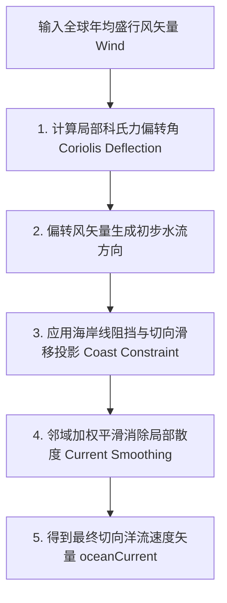

# 第 6 章 · 风生大洋环流与海表温度传输

大洋环流（Ocean Circulation）是地球气候系统的“巨大热机”与热量输送带。本章探讨奇幻地图生成器如何通过风应力驱动、科里奥利偏转、海岸阻挡约束以及图平流-扩散方程，确定性地模拟大洋表层洋流与海表温度（SST, Sea Surface Temperature）及其距平场。

---

## 1. 物理海洋学背景

大洋表层洋流主要由低层大气盛行风带的摩擦应力驱动。在大尺度空间中，受以下关键物理规律支配：

```text
 1. 盛行风应力驱动 (Wind Stress)   2. 科氏力偏转 (Coriolis Effect)   3. 海岸线阻挡与大洋环流 (Gyres)
        ────────► 风向                  北半球: 右偏                        ┌────────►───────┐
             │                          南半球: 左偏                        ▲                │
             ▼ 摩擦带动                 偏转角 ∝ sin(Latitude)             │    大洋环流    ▼
        ────────► 表层水流                                                  └───────◄────────┘
```

- **副热带大洋环流（Subtropical Gyres）**：在低纬信风与中纬西风共同驱动下，北半球呈顺时针、南半球呈逆时针的大尺度环流圈；
- **洋流性质**：
  - **暖流（Warm Currents）**：由低纬度流向高纬度（如墨西哥湾暖流、黑潮），使沿岸气温升高、增湿增雨；
  - **寒流（Cold Currents）**：由高纬度流向低纬度（如加利福尼亚寒流、秘鲁寒流），使沿岸降温减湿，常在沿岸形成热带/亚热带沿海沙漠。

---

## 2. 表层洋流矢量场生成

洋流矢量直接建立在各海洋网格点上：



### 2.1 科氏偏转角计算
对于纬度为 $\phi$ 的海洋单元，科氏力偏转角 $\theta_{\text{coriolis}}$ 与正弦纬度相关：

$$\theta_{\text{coriolis}} = \operatorname{sign}(\phi) \cdot \operatorname{clamp}(|\sin \phi| \cdot 0.48, \, 0, \, 0.48)$$

- 赤道附近（$\phi \approx 0$）偏转角趋于 0，水流基本与风向平行；
- 中高纬度地区，偏转角可达 $\approx 27.5^\circ$（北半球向右偏，南半球向左偏）。

### 2.2 海岸线阻挡与切向投影约束 (Coast Constraint)
当洋流撞击海岸时，垂直于海岸线的法向速度必须迅速衰减至 0，而平行于海岸的切向分量得以保留并形成沿岸流：

$$\mathbf{v}_{\text{coast}} = \mathbf{v} - (\mathbf{v} \cdot \mathbf{n}_{\text{coast}}) \mathbf{n}_{\text{coast}}$$

若水流直接迎面吹向封闭陆地，则速度逐渐衰减；若沿海岸滑动，则形成强劲的狭窄边界流（Boundary Currents）。

---

## 3. 大洋热量平流-扩散模型 (SST Advection-Diffusion)

为了获得物理自洽的海表温度场，系统不使用静态的经验公式，而是运行了一个 **图平流-扩散热传输迭代过程**（如执行 36 轮图平流计算）。

```text
               j (上游海洋单元, 温度 Tj)
               │
               │ 洋流流动 v_ji
               ▼
               i (当前海洋单元, 温度 Ti) ──► 绝热辐射冷却/升温向基准温平衡
```

### 3.1 辐射平衡基准海温（Radiative Equilibrium SST）
海洋在无洋流运动时的理论纬度绝热平衡温度：

$$T_{\text{base}}(\phi) = 28.5 \cdot \cos^{0.85}(\phi) - 2.5$$

- 赤道海温基准约为 $26.0^\circ\text{C}$；
- 极地海温基准降至海水冰点 $-1.8^\circ\text{C}$。

### 3.2 离散图热传导方程
在每次平流迭代步中，单元 $i$ 的温度更新公式：

$$T_i^{(t+1)} = (1 - \lambda_{\text{relax}}) T_i^{(t)} + \lambda_{\text{relax}} T_{\text{base}}(\phi) + \sum_{j \in \text{Neighbors}(i)} \alpha_{ji} (T_j^{(t)} - T_i^{(t)})$$

- $\alpha_{ji}$ 为上游单元 $j$ 向单元 $i$ 流动的洋流速度在连接轴上的投影权重；
- $\lambda_{\text{relax}}$ 为海气热交换向纬度基准温弛豫恢复的阻尼系数。

### 3.3 海表温度距平（SST Anomaly）

海表温度距平定义为实际海温与纬度基准海温的差值：

$$\Delta T_{\text{SST}} = T_{\text{SST}} - T_{\text{base}}(\phi)$$

$$\Delta T_{\text{SST}} \in [-8.0^\circ\text{C}, \, +8.0^\circ\text{C}]$$

- $\Delta T_{\text{SST}} > 0$：**暖流区**（如大洋西边界暖流，使得高纬度海域异常温暖）；
- $\Delta T_{\text{SST}} < 0$：**寒流区**（如大洋东边界寒流与上升流区，导致海温大幅偏低）。

---

## 4. 海洋热量向沿岸大陆的扩散渗透

海洋的温度不仅影响海洋本身，还通过海风向邻近的大陆边缘渗透。

利用热量扩散算子将海温距平传导至沿岸 $2 \sim 3$ 层陆地单元：

```python
# 沿岸陆地单元吸收邻近海温距平伪代码
for each region in landRegions:
    if isCoastal(region):
        coastalOceanAnomaly = Average(neighboringOceanAnomalies(region))
        # 随内陆深度 (continentality) 快速衰减
        surfaceTemperatureAnomaly[region] = coastalOceanAnomaly * (1.0 - continentality[region])
```

- 使得受暖流冲刷的西欧型海岸冬季温和多雨；
- 使得受寒流影响的西撒哈拉型西海岸干燥少雨，形成沿海荒漠。
