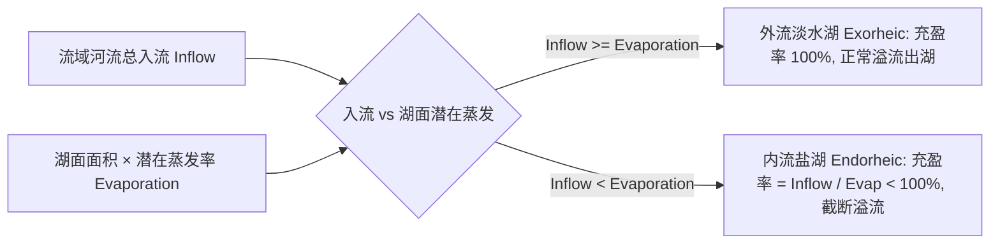

# 第 8 章 · 封闭湖盆、水水平衡与湖泊演化

湖泊（Lakes）是陆地水循环的关键节点与水下地貌。本章剖析奇幻地图生成器如何通过 **Priority-Flood 填洼算法** 与 **两阶段水文迭代模型（Two-Pass Hydrological Coupling）**，实现从封闭地形洼地提取、流域入流与蒸发水平衡收支，到外流/内流湖判定、盐度浓缩与季节性结冰的完整物理模拟。

---

## 1. 湖泊成因与水文学理论

在自然界中，湖泊主要分布在地表局部封闭洼地中：
- **外流湖（Exorheic Lakes）**：流域降水与河流补给量大于湖面蒸发损失，湖水上升并漫过最低隘口（溢流口 Outlet），溢出形成下游河流，水体保持低盐度淡水；
- **内流湖 / 尾闾湖（Endorheic Lakes）**：位于干旱或半干旱气候区，入流补给量小于或等于湖面蒸发能力，湖水无法溢出，矿物质随蒸发不断浓缩，形成微咸湖、咸水湖（如里海）甚至超咸死海；
- **季节性游移湖（Seasonal Playas）**：在干季干涸露出盐滩，湿季蓄水形成浅湖。

```text
               外流湖 (Exorheic Lake)                     内流湖 (Endorheic Lake)
         入流 Inflow > 蒸发 Evaporation              入流 Inflow ≤ 蒸发 Evaporation
            ┌───────────────────┐                       ┌───────────────────┐
  河流入流 ─►│ 蓄满维持恒定湖面  ├─► 溢流下游河流   河流入流 ─►│ 水位萎缩 / 盐分浓缩 │ (无外流出口)
            └───────────────────┘                       └─────────┬─────────┘
                                                                  ▼
                                                          蒸发进入大气 (形成盐湖)
```

---

## 2. 阶段 L1：基于 Priority-Flood 的地形湖盆识别

在地形生成阶段，由于分形噪声和构造起伏，地表天然存在封闭洼地。

系统实现了改进的 **球面 Priority-Flood 填洼算法**：

```mermaid
flowchart TD
    A[输入原始高程 baseElevation 与陆地掩码] --> B[1. 将所有海洋边缘单元作为基准海平面压入最小堆 MinHeap]
    B --> C[2. 依次弹出堆顶最低节点，向内陆相邻节点传播排水高程]
    C --> D[3. 计算填洼高程 filledElevation = max(currentElev, popElev)]
    D --> E[4. 提取填洼深度大于 0 的连通区域作为候选盆地]
    E --> F[5. 计算候选湖盆的最低溢流口 Outlet 与溢流目标 Target]
    F --> G[6. 依据深度/面积/海岸距离评分筛选，确定 L1 地形湖面]
```

### 2.1 填洼深度与潜在库容
对于任意陆地单元 $r$：

$$\text{DepressionDepth}(r) = \operatorname{filledElevation}(r) - \operatorname{baseElevation}(r)$$

- 若 $\text{DepressionDepth}(r) > 0$，则该区域位于一个封闭集水洼地内部；
- 候选湖盆的 **潜在库容（Volume Capacity）**：
  $$V_{\text{potential}} = \sum_{r \in \text{Basin}} \text{RegionArea}(r) \cdot \text{DepressionDepth}(r)$$

---

## 3. 阶段 L2：水文水平衡迭代求解 (Water Balance)

阶段 L1 仅给出了几何上的“最大可能湖盆”。如果一个巨大盆地位于降水极少的荒漠中，它不可能蓄满成湖。

阶段 L2 将初版河网汇入的流域入流量（$\text{Inflow}$）与湖面开放水体蒸发量（$\text{Evaporation}$）进行收支平衡求解：



### 3.1 湖面开放蒸发量计算
对于湖泊 $L$，其年均蒸发量取决于所在纬度的湖面温度与干燥度：

$$E_{\text{lake}}(L) = \sum_{r \in L} \text{RegionArea}(r) \cdot \operatorname{clamp}\left(\frac{T_{\text{warmest}}(r) + 2.0}{18.0}, \, 0.05, \, 2.5\right) \cdot \text{EvapFactor}$$

### 3.2 湖泊充盈率（Fill Ratio）与状态判定

$$\text{FillRatio} = \operatorname{clamp}\left( \frac{\text{Inflow}}{E_{\text{lake}}}, \, 0.0, \, 1.0 \right)$$

1. **外流湖（$\text{FillRatio} \ge 0.95$）**：
   - 湖泊完全充满，多余水量通过溢流口漫出；
   - 湖泊标记为外流湖，水体保持淡水（$\text{Salinity} = 0.0$）；
2. **内流萎缩湖（$\text{FillRatio} < 0.95$）**：
   - 湖泊入不敷出，出口干涸断流；
   - 水位下降，边缘浅水单元退出水体变回陆地。

---

## 4. 盐度演化与结冰状态模拟

### 4.1 盐度浓缩方程（Salinity Index）
对于内流湖，随径流汇入的矿物质无法排出，盐度随充盈率与蒸发强度指数级累积：

$$\text{Salinity} = \operatorname{clamp}\left( (1.0 - \text{FillRatio})^{1.8} \cdot \left(1.0 + 0.35 \cdot \frac{E_{\text{lake}}}{\text{Area}}\right), \, 0.0, \, 1.0 \right)$$

- $\text{Salinity} < 0.15$：**淡水/微咸水**；
- $0.15 \le \text{Salinity} < 0.65$：**咸水湖**（呈现青蓝或深碧色）；
- $\text{Salinity} \ge 0.65$：**高盐死海/干盐湖**（边缘析出白色盐壳）。

### 4.2 湖泊热力结冰状态（Lake Ice State）

根据最热月气温 $T_{\text{warmest}}$ 与最冷月气温 $T_{\text{coldest}}$，湖泊划分为三种冰冻状态：

| 冰冻状态分类 | 英文标识 | 判定条件 | 视觉与地理特征 |
| :--- | :---: | :--- | :--- |
| **常年不冻湖** | `OpenWater` | 最冷月气温 $T_{\text{coldest}} > 0^\circ\text{C}$ | 终年开阔碧蓝水体 |
| **季节性结冰湖** | `SeasonallyFrozen` | 最冷月 $T_{\text{coldest}} \le 0^\circ\text{C}$ 且 最热月 $T_{\text{warmest}} > 0^\circ\text{C}$ | 冬季湖面封冻呈现淡青色冰面，夏季解冻 |
| **永久冰下湖** | `Subglacial` | 最热月气温 $T_{\text{warmest}} \le 0^\circ\text{C}$ | 位于极地永久冰盖下，呈现白色冰原纹理 |
