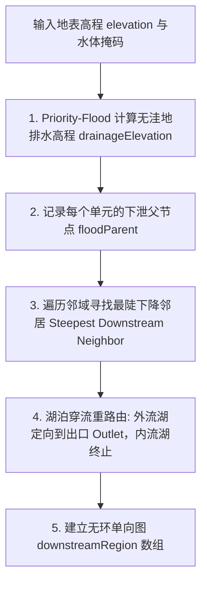

# 第 9 章 · 地表径流汇流与河网系统

河流（Rivers）是地表水文网络的大动脉，既是地貌侵蚀的塑造者，也是孕育文明聚落的生命线。本章剖析奇幻地图生成器如何基于无洼地排水高程、D8 最陡坡降、沿径流累积汇流、湖泊穿流拓扑、季节性断流判定以及球面平滑曲线生成，构建逼真自洽的全球水系网络。

---

## 1. 水文学汇流理论与模型

在自然界中，雨水降落到地表形成有效径流（Runoff）后，在重力作用下沿着最陡地形坡度向下汇聚：

```text
 降水 - 蒸发 = 地表有效径流 Runoff
                  │
                  ▼
          沿最陡坡降向下单向流动
                  │
                  ▼
         汇流累积量 Flow Accumulation
                  │
                  ├── 若 累积流量 < 阈值 ──► 坡面细流 (未成河)
                  │
                  └── 若 累积流量 ≥ 阈值 ──► 发育为主干河流 / 支流 (River Segment)
```

- **水系分级**：随着支流不断汇入，下游河道流量呈阶梯式增长，河床逐渐拓宽；
- **汇入终点**：河流最终流入海洋（外流水系）或注入内陆封闭咸水湖（内流水系）。

---

## 2. 无洼地排水网络构建 (Hydrological Conditioning)

在原始离散网格上，由于噪声起伏，常存在大量局部微小洼地。如果不进行处理，河流将在山顶微洼地中陷入死循环而无法流向大海。

算法通过两步构建保证单调下降的无洼地水文表面：



### 2.1 坡度下降选择逻辑
对于陆地单元 $u$，其下游流向 $v = \text{downstream}[u]$ 按以下优先级确定：
1. **严格低于 $u$ 的邻居中高程降幅最大者**：
   $$\text{Slope}(u, w) = \frac{\operatorname{drainageElevation}(u) - \operatorname{drainageElevation}(w)}{\operatorname{Distance}(u, w)}$$
2. **若处于平坦洼地或鞍部**：直接沿填洼算法记录的 `floodParent` 方向流向溢流口；
3. **若相邻为海洋或外流湖**：优先直接入海/入湖。

---

## 3. 径流汇流累积算法 (Flow Accumulation)

确定单向流向后，整个地表构成了一组 **有向无环森林（Forest of DAGs）**。

```python
# 拓扑排序汇流累积伪代码
function AccumulateFlow(regions, downstream, runoff, area):
    # 1. 统计每个节点的入度 (有几个上游节点流向它)
    inDegree = ComputeInDegree(regions, downstream)
    queue = [r for r in regions if inDegree[r] == 0]
    
    # 初始流量为本单元产生的基础径流量
    flowAccumulation = [area[r] * max(0, runoff[r]) for r in regions]
    
    # 2. 沿拓扑序向下游累加传递
    while queue is not empty:
        curr = queue.pop()
        target = downstream[curr]
        if target is valid:
            flowAccumulation[target] += flowAccumulation[curr]
            inDegree[target] -= 1
            if inDegree[target] == 0:
                queue.push(target)
                
    return flowAccumulation
```

每个单元的汇流累积量递推公式：

$$\text{FlowAcc}(v) = \text{RegionArea}(v) \cdot \text{Runoff}(v) + \sum_{u \in \text{Upstream}(v)} \text{FlowAcc}(u)$$

- 上游流域面积越广、气候降水越丰沛（如热带雨林区），下游节点的 $\text{FlowAcc}$ 增长越快；
- 干旱荒漠区即使流域面积巨大，由于有效径流 $\text{Runoff} \approx 0$，累积流量依然极低，难以发育成河。

---

## 4. 河网提取与几何过滤

### 4.1 全球汇流阈值
系统根据全球陆地总径流量动态计算成河门槛：

$$\text{ThresholdFlow} = \text{TotalRunoff} \cdot \text{riverBasinThreshold}$$

- 仅当 $\text{FlowAcc}(r) \ge \text{ThresholdFlow}$ 时，该网格单元被激活为河流段；
- 调节参数 `riverBasinThreshold` 可全局控制地图上河流网络的密集程度。

### 4.2 源头与长度过滤
- **源头高度过滤**：河流源头单元的真实高程须达到指定门槛（`riverMinSourceElevation`），防止在低洼近海平原凭空冒出断头小河；
- **最短长度过滤**：丢弃流经步数过短（如 $< 4$ 个单元）的微型水系片段，保持地图视觉清爽。

---

## 5. 季节性河流与时令断流判定 (River Seasonality)

气候具有强烈的季节性（如季风区夏季暴雨、冬季干旱）。系统通过计算 4 个代表性季度（1月、4月、7月、10月）的季节汇流累积量：

$$\text{RiverSeasonality} = \operatorname{clamp}\left( 1.0 - \frac{\min_{\text{seasons}} \text{FlowAccumulation}}{\max_{\text{seasons}} \text{FlowAccumulation}}, \, 0.0, \, 1.0 \right)$$

```python
# 季节性河流分类判定伪代码
if driestSeasonFlow < peakFlow * 0.25:
    # 最枯季流量低于年峰值流量 25%，判定为季节性河流
    isSeasonalRiver = true
```

- **常年性河流（Perennial Rivers）**：水量充沛稳定，3D 视图中呈现深蓝色实线；
- **季节性时令河（Intermittent Rivers）**：干季断流露出干涸河床，3D 视图中呈现青灰色虚线或半透明河道（如塔里木河、澳洲内陆时令河）。

---

## 6. 河流几何平滑与 3D 带状网格构建

离散的单元连接线在渲染时被转化为连续光滑的 3D 几何体：

```text
       Region A                  Midpoint                 Region B
          ●──────────────────────────*─────────────────────────●
                                   /   \
                         球面二次贝塞尔曲线平滑插值
                                   \   /
                      ═════════════════════════════════► 自适应河宽 (∝ √Flow)
```

1. **测地线曲线平滑**：在上游单元、当前单元与下游单元之间进行球面贝塞尔插值，消除多边形网格生硬的折角；
2. **流量自适应河宽**：
   $$\text{RiverWidth} = W_{\text{base}} + W_{\text{scale}} \cdot \sqrt{\frac{\text{FlowAcc}}{\text{MaxFlow}}}$$
   河流从源头涓涓细流向河口宽阔大江平滑拓宽；
3. **入海口/入湖口渐变羽化**：河口顶点法向自然融入水面，避免几何穿模。
