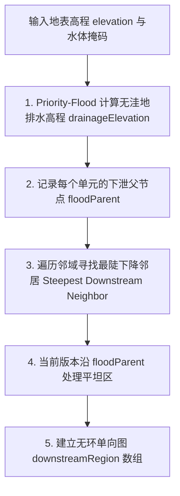

# 第 9 章 · 地表径流汇流与河网系统

> **实现状态：**当前已接入年均径流驱动的水力侵蚀与守恒泥沙输送，地形变化后刷新一次气候，再以最终高程、海陆和年均径流构建排水图及河网。汇流保存面积加权累积量与物理年均流量。河段按主干与支流拼接为连续球面曲线，汇流点由局部连接面覆盖；入海河段收口到陆海共享边界。湖泊穿流、海洋三角洲与季节性流量仍待后续迭代。

河流（Rivers）既塑造地貌，也影响聚落。本章描述基于无洼地排水高程、最陡坡降、年均径流加权汇流和河网阈值的第一版全球水系，以及后续湖泊穿流与季节断流的扩展方向。

---

## 1. 水文学汇流理论与模型

在自然界中，雨水降落到地表形成有效径流（Runoff）后，在重力作用下沿着最陡地形坡度向下汇聚：

```text
 降水 - 蒸发 = 地表有效径流 Runoff
                  │
                  ▼
          沿最陡坡降向下单向流动
                  │
                  ▼
         汇流累积量 Flow Accumulation
                  │
                  ├── 若 累积流量 < 阈值 ──► 坡面细流 (未成河)
                  │
                  └── 若 累积流量 ≥ 阈值 ──► 发育为主干河流 / 支流 (River Segment)
```

- **水系分级**：随着支流不断汇入，下游河道流量呈阶梯式增长，河床逐渐拓宽；
- **汇入终点**：河流最终流入海洋（外流水系）或注入内陆封闭咸水湖（内流水系）。

---

## 2. 无洼地排水网络构建 (Hydrological Conditioning)

在原始离散网格上，由于噪声起伏，常存在大量局部微小洼地。如果不进行处理，河流将在山顶微洼地中陷入死循环而无法流向大海。

算法通过两步构建保证单调下降的无洼地水文表面：



### 2.1 坡度下降选择逻辑
对于陆地单元 $u$，其下游流向 $v = \text{downstream}[u]$ 按以下优先级确定：
1. **严格低于 $u$ 的陆地邻居中坡降最大者**（考虑球面距离）：
   $$\text{Slope}(u, w) = \frac{\operatorname{drainageElevation}(u) - \operatorname{drainageElevation}(w)}{\operatorname{Distance}(u, w)}$$
2. **无下降陆地邻居但相邻海洋**：直接入海，记录出口标记；
3. **其他平坦区**：沿填洼算法记录的 `floodParent` 方向流向溢流口。没有海洋边界的完整陆地分量以最低单元作为封闭汇点；尚未识别正式外流湖。

---

## 3. 径流汇流累积算法 (Flow Accumulation)

确定单向流向后，陆地部分构成一组 **有向无环森林（Forest of DAGs）**；汇流累积按下游图的拓扑顺序传播，避免近似高程排序打乱父子次序。直接入海的边作为外流水系出口，尚未识别独立湖泊出口。

```text
# 拓扑排序汇流累积伪代码
function AccumulateFlow(regions, downstream, runoff, area):
    # 1. 统计每个节点的入度 (有几个上游节点流向它)
    inDegree = ComputeInDegree(regions, downstream)
    queue = [r for r in regions if inDegree[r] == 0]

    # 初始流量为本单元产生的基础径流量
    flowAccumulation = [area[r] * max(0, runoff[r]) for r in regions]

    # 2. 沿拓扑序向下游累加传递
    while queue is not empty:
        curr = queue.pop()
        target = downstream[curr]
        if target is valid:
            flowAccumulation[target] += flowAccumulation[curr]
            inDegree[target] -= 1
            if inDegree[target] == 0:
                queue.push(target)

    return flowAccumulation
```

每个单元的汇流累积量递推公式：

$$\text{FlowAcc}(v) = \text{RegionArea}(v) \cdot \text{Runoff}(v) + \sum_{u \in \text{Upstream}(v)} \text{FlowAcc}(u)$$

- 上游流域面积越广、气候降水越丰沛（如热带雨林区），下游节点的 $\text{FlowAcc}$ 增长越快；
- 干旱荒漠区即使流域面积巨大，由于有效径流 $\text{Runoff} \approx 0$，累积流量依然极低，难以发育成河。

`RegionArea` 是单位球面面积；兼容字段 `flowAccumulation` 的单位为 mm/年 × 球面面积。采用固定地球半径 $R=6\,371\,000\,\mathrm{m}$ 后，物理面积与年均流量为：

$$A_v=\mathrm{RegionArea}(v)R^2,\qquad Q_v=\mathrm{FlowAcc}(v)\frac{R^2}{1000\times365\times86400}\quad[\mathrm{m^3/s}]$$

`discharge` 用于年均汇流图层和水力地貌演化；河网阈值仍使用兼容累积量，两者仅相差固定单位系数。排水生成器公开 `topologicalOrder`，水力侵蚀与最终水文共用同一套路由算法。几何汇流图层沿最终排水图累加上游单元数，可对照流域形状；单元数不等于物理集水面积，且随网格精度变化。

---

## 4. 河网提取与几何过滤

### 4.1 全球汇流阈值
第一版根据全球陆地年均汇流总量与最大单元汇流量动态计算成河门槛：

$$\text{ThresholdFlow} = \min\left(0.4 \cdot \text{MaxFlow},\; \max(\text{MinimumFlow},\; \text{TotalFlow} \cdot \text{ThresholdFraction})\right)$$

- 仅当 $\text{FlowAcc}(r) \ge \text{ThresholdFlow}$ 时，该网格单元被激活为河流段；
- `ThresholdFraction` 控制总汇流转化为成河门槛的比例，`MinimumFlow` 防止极端小流量场产生过密线段；
- 当前阈值采用固定比例与最大汇流上限，保证不同种子下仍能得到可见但不过密的河网；后续可将比例开放为世界参数。

### 4.2 当前版本的几何过滤
- 当前以年均汇流是否达到阈值作为主要成河条件，并跳过无下游的陆地单元；
- 源头高度、最短长度和流域连通性过滤保留为后续调参项，避免第一版过早丢弃小型但合理的支流。

---

## 5. 季节性河流与时令断流判定 (River Seasonality)

这一节属于下一阶段。当前河网只使用年均径流，因此不会随气候月份改变河流掩码或条带透明度。

气候具有强烈的季节性（如季风区夏季暴雨、冬季干旱）。方案拟计算 4 个代表性月份（1月、4月、7月、10月）的汇流累积量：

$$\text{RiverSeasonality} = \operatorname{clamp}\left( 1.0 - \frac{\min_{\text{seasons}} \text{FlowAccumulation}}{\max_{\text{seasons}} \text{FlowAccumulation}}, \, 0.0, \, 1.0 \right)$$

```text
# 季节性河流分类判定伪代码
if driestSeasonFlow < peakFlow * 0.25:
    # 最枯季流量低于年峰值流量 25%，判定为季节性河流
    isSeasonalRiver = true
```

- **常年性河流（Perennial Rivers）**：水量充沛稳定，3D 视图中呈现深蓝色实线；
- **季节性时令河（Intermittent Rivers）**：干季断流露出干涸河床，3D 视图中呈现青灰色虚线或半透明河道（如塔里木河、澳洲内陆时令河）。

---

## 6. 河流几何平滑与 3D 带状网格构建

当前版本先沿下游关系挑选汇合处流量最大的上游作为主干，将短河段拼成连续路径，再对路径做球面三次 Bézier 采样。3D 条带在一条路径内共用横截面顶点，并用局部圆面覆盖支流汇合点；河流统一使用蓝色，宽度随汇流量的平方根增长，源头沿首段从尖细逐渐过渡到正常河宽。曲线增加了段内采样，并对宽度过渡做缓动以减轻急转处的折角。地形启用高程位移时，3D 河道沿单元高程贴合地表并留出小幅间距，避免被地表遮挡；2D 地图的最小屏幕宽度也沿首段渐增，兼顾源头过渡和细小河流的可见性。入海段终点使用陆地单元与海洋单元的共享 Voronoi 边界中点，并保留河道宽度、向河口轻微展宽，避免收成针尖或提前截断。河口三角洲仍属于后续迭代。

离散的单元连接线在渲染时被转化为连续光滑的 3D 几何体：

```text
       Region A                  Midpoint                 Region B
          ●──────────────────────────*─────────────────────────●
                                   /   \
                         球面三次贝塞尔曲线平滑插值
                                   \   /
                      ═════════════════════════════════► 自适应河宽 (∝ √Flow)
```

1. **测地线曲线平滑**：在上游单元、当前单元与下游单元之间进行球面贝塞尔插值，消除多边形网格生硬的折角；
2. **流量自适应河宽**：
   $$\text{RiverWidth} = W_{\text{base}} + W_{\text{scale}} \cdot \sqrt{\frac{\text{FlowAcc}}{\text{MaxFlow}}}$$
   河流从源头涓涓细流向河口宽阔大江平滑拓宽；
3. **统一河流样式**：所有河段使用同一蓝色，河宽随汇流量变化；河口保持河道宽度并轻微展宽。

---

## 7. 径流驱动侵蚀与守恒泥沙输送

### 7.1 调度与单位

`FluvialErosionProcessor` 在初始年均气候之后运行，使用物理 km 高程、m 距离、m² 区域面积与 m³/s 年均流量。强度 $s\in[0,1]$ 映射为 $100000s$ 年的校准形态演化时长及最多 12 个子步（$\max(1,\mathrm{round}(12s))$）；强度为零时完全跳过。该时长用于控制过程生成强度，并不表示星球真实年龄。

每个子步从当前地形重建排水图。Priority-Flood 只改排水副本，不直接抬升或切割真实地形。侵蚀坡度 $S$ 使用真实高程差除以物理距离，填洼产生的虚拟坡降不能提供侵蚀能量。子步固定使用初始年均有效径流，侵蚀之后只刷新一次气候，最终河网读取刷新后的高程与径流。

### 7.2 河道下切与输沙能力

初版采用 $\sqrt{Q}S$ 河流功率形式和坡度相关体积输沙容量：

$$d_e=0.004\sqrt{Q}S\Delta t,\qquad C=Q\,(365\times86400)\min\left(0.05,\;0.002\sqrt{S/0.01}\right)\Delta t$$

其中 $d_e$ 是潜在侵蚀厚度（m），$C$ 为当前子步的输沙容量（m³），$\Delta t$ 用年表示；系数用于形态校准。实际侵蚀还受剩余输沙容量、单步 30 m、当前真实高差的 25% 和陆地最低 0.1 m 高程限制。上游泥沙已经占满容量时，下游不再额外凭空产生侵蚀。

### 7.3 泥沙守恒与沉积

按上游到下游的拓扑序处理。每个单元先接收上游输沙及上一步局部滞留，按容量搬运；超出容量的泥沙转为沉积厚度（体积除以区域面积）。沉积受单步 30 m 及实际供沙上游高程限制；平坦或不供沙的支流不会压制洪泛平原沉积。超过可容纳厚度的部分显式保存为 `sedimentStorage`，下一步重新参与输送。

- 陆地到陆地：输沙体积传给下游；
- 陆地到海洋：记录 `sedimentExport`，不改动海底或海岸；
- 封闭汇点：没有下游输送容量，泥沙沉积或留存。

每个单元单独保存累计侵蚀和累计沉积（km），不以净高程差替代二者。`sedimentThroughput`、`sedimentExport`、`sedimentStorage` 均用 m³ 保存；全局记录：

$$V_{\mathrm{eroded}}=V_{\mathrm{deposited}}+V_{\mathrm{exported}}+V_{\mathrm{retained}}$$

收支误差不包含最终 Float32 高程存储的舍入；舍入导致的陆地体积变化单独保存为 `elevationQuantizationErrorM3`。调试面板可查看初始侵蚀驱动径流、最终年均径流与流量、累计厚度、局部入海／滞留及全局泥沙收支误差。

此版本保持海陆身份，尚不模拟海洋三角洲、正式湖泊水平衡、地下水、岩性差异或季节洪峰。洼地连通仍为简化排水处理；局部滞留泥沙是明确的库存，不代表已经生成湖泊或完整冲积地貌。
