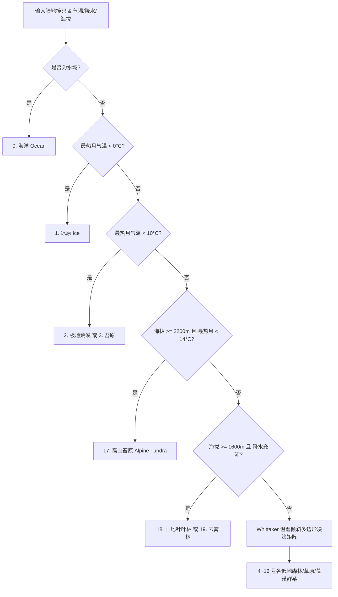

# 第 10 章 · 生物群系与生态系统分类

生物群系（Biomes）反映了地表宏观植被与生态景观的分布规律。本章探讨奇幻地图生成器如何基于经典 **惠特克（Whittaker）生态学图谱** 进行增强扩展，结合年均气温、最热月气温、年降水量、降水季节性以及物理海拔，确定性地划分全球 20 种典型陆地与山地生态系统。

---

## 1. 生态学理论模型：惠特克图谱 (Whittaker Biome Diagram)

在生物地理学中，陆地生物群系的宏观分布主要由两个核心气候因子决定：
1. **热量因子**：年均气温（MAT, Mean Annual Temperature）或最热月气温；
2. **水分因子**：年降水量（MAP, Mean Annual Precipitation）。

```text
  年降水量 (mm)
      ▲
 4000 │                                            热带雨林 (Tropical Rainforest)
      │                                          ／
 3000 │                    温带雨林            ／  热带季节林 (Seasonal Forest)
      │                  (Temperate RF)      ／
 2000 │                        │           ／    热带干旱林 (Dry Forest)
      │      北方针叶林        │  温带落叶林     ／
 1000 │     (Boreal/Taiga)     │ (Temperate SF)／  热带稀树草原 (Savanna)
      │          │             │             ／
  500 │   苔原   │    温带草原 (Grassland)  ／
      │ (Tundra) │  温带疏林 (Woodland)   ／
    0 ┼──────────┴───────────────────────┴────────────────────────► 年均温 (°C)
     -15°C       0°C                    15°C                     30°C
```

---

## 2. 20 类细分生物群系体系

系统定义了 20 种高精度生态类型：

| 编码 ID | 生物群系名称 (Biome) | 典型特征与植被形态 | 主导气候条件 |
| :---: | :--- | :--- | :--- |
| **0** | **海洋 (Ocean)** | 开放大洋与陆架海域 | 地表掩码为水域 |
| **1** | **冰原 (Ice)** | 终年冰雪覆盖的极地或高大陆冰盖（格陵兰/南极） | 最热月气温 $< 0^\circ\text{C}$ |
| **2** | **极地荒漠 (Polar Desert)** | 极寒干燥的冰缘裸露岩石与冻土带 | 最热月 $< 10^\circ\text{C}$ 且 降水 $< 180\text{mm}$ |
| **3** | **苔原 (Tundra)** | 地衣、苔藓、低矮灌木与永冻层 | 最热月 $< 10^\circ\text{C}$ 且 降水 $\ge 180\text{mm}$ |
| **4** | **北方针叶林 (Boreal Forest)** | 泰加林（落叶松、云杉、冷杉组成的广袤针叶林） | 年均温 $< 5^\circ\text{C}$，降水 $> 300\text{mm}$ |
| **5** | **寒冷荒漠 (Cold Desert)** | 中高纬内陆干旱戈壁与盐滩（如戈壁沙漠） | 年均温 $< 8^\circ\text{C}$，降水极低 |
| **6** | **温带草原 (Temperate Grassland)** | 广阔的温带大草原与草甸（如欧亚大草原、北美大平原） | 温带半干旱，年降水 $250 \sim 600\text{mm}$ |
| **7** | **温带疏林 (Temperate Woodland)** | 稀疏树木与草地相间的开阔景观 | 温带半湿润过渡带 |
| **8** | **地中海灌丛 (Mediterranean)** | 硬叶常绿灌木林（如橄榄、冬青栎） | 夏季炎热干燥、冬季温和多雨 |
| **9** | **温带季节林 (Temperate Seasonal)** | 温带落叶阔叶林与混交林（四季分明，秋季落叶） | 温带湿润，降水 $700 \sim 1500\text{mm}$ |
| **10** | **温带雨林 (Temperate Rainforest)** | 湿润温带巨树森林（如北美西海岸红杉林） | 温带海洋性，降水 $> 1800\text{mm}$ |
| **11** | **热荒漠 (Hot Desert)** | 终年炎热干燥的流动沙丘与石漠（如撒哈拉） | 热带/亚热带高压带，降水 $< 200\text{mm}$ |
| **12** | **旱生灌丛 (Xeric Shrubland)** | 刺灌木、多肉仙人掌与耐旱耐热植被 | 荒漠边缘半干旱地带 |
| **13** | **热带稀树草原 (Tropical Savanna)** | 萨凡纳金黄色高草稀树景观（如东非大草原） | 热带干湿季分明，夏季降水充沛 |
| **14** | **热带干旱林 (Tropical Dry Forest)** | 旱季完全落叶的热带季雨林 | 热带长干季过渡带 |
| **15** | **热带季节林 (Tropical Seasonal)** | 半常绿季雨林与次生雨林 | 热带短干季湿润区 |
| **16** | **热带雨林 (Tropical Rainforest)** | 终年常绿、多层冠层的繁茂热带森林（如亚马逊） | 赤道低压带，年均温 $> 20^\circ\text{C}$，降水 $> 2000\text{mm}$ |
| **17** | **高山苔原 (Alpine Tundra)** | 超过高山林线（Tree line）的高山冻原与草甸 | 物理海拔 $\ge 2200\text{m}$ 且 最热月 $< 14^\circ\text{C}$ |
| **18** | **山地针叶林 (Montane Conifer)** | 亚高山针叶林垂直自然带 | 物理海拔 $\ge 1600\text{m}$，年均温 $< 12^\circ\text{C}$ |
| **19** | **山地云雾林 (Montane Cloud Forest)** | 高山迎风坡常年云雾缭绕的热带/亚热带山地常绿阔叶雨林 | 物理海拔 $\ge 1600\text{m}$，降水 $> 1400\text{mm}$ |

---

## 3. 分类判定算法与核心法则

生态判定流程按照严格的优先级分支执行：



### 3.1 极地与极寒边界法则
- **冰原（Ice）**：最热月气温 $T_{\text{warmest}} < 0^\circ\text{C}$，夏季地表积雪无法消融，形成永久大陆冰盖；
- **苔原与极地荒漠**：最热月气温 $0^\circ\text{C} \le T_{\text{warmest}} < 10^\circ\text{C}$，受降水量 $180\text{mm}$ 分界。

### 3.2 高山垂直自然带谱（Montane Elevation Spectrum）
随着海拔上升，由于气温骤降，山体呈现出不同于基带平原的垂直植被演替：
- **高山林线以上（Alpine Zone）**：海拔 $\ge 2200\text{m}$，树木无法生长，被灌丛草甸取代，判定为 **高山苔原（Alpine Tundra）**；
- **迎风坡多雨高山**：海拔 $\ge 1600\text{m}$ 且年降水量 $\ge 1400\text{mm}$，云雾拦截率极高，判定为珍贵的 **山地云雾林（Montane Cloud Forest）**。

### 3.3 地中海气候与季风特征提取
利用夏季降水（`summerPrecipitationMm`）与冬季降水（`winterPrecipitationMm`）的对比：
- 若 **冬雨夏干**（冬季降水超过夏季 2.2 倍），且年均温处于温和区间（$10^\circ\text{C} \sim 22^\circ\text{C}$），判定为 **地中海灌丛（Mediterranean Shrubland）**。
