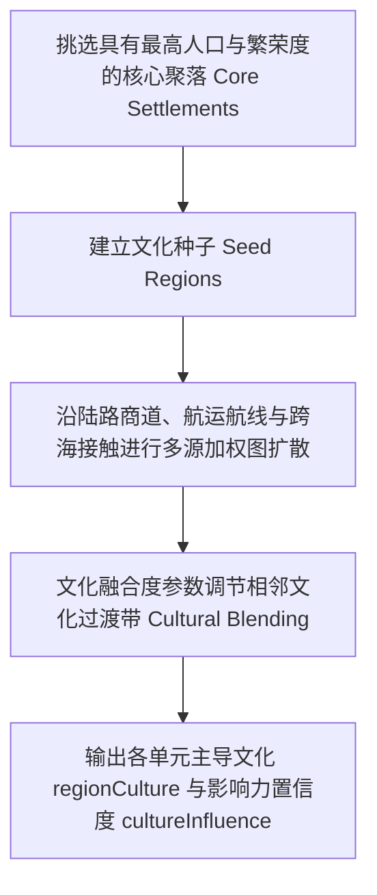

# 第 11 章 · 人文地理、地缘网络与社会演化

> **设计状态：**当前生成流程和渲染数据没有聚落、道路、贸易、文化、国家、宗教或地名。年均与 12 个月气候输入已经可用，正式湖泊、河网和水文可达性仍待实现；本章为后续人文地理系统方案。

自然地理环境是人类文明孕育与社会演化的基石。本章规划从宜居性与聚落层级，到交通、贸易、文化、国家、宗教和地名的仿真流程。

---

## 1. 人文地理学设计原则与演化流水线

人文地理方案遵循**自然地理单向驱动与社会层级级联演化原则**：自然地理数据（高程、温度、降水、河流、海岸）决定基础宜居性与通行阻力；聚落在此基础上建立交通与贸易网络；贸易与交往进而孕育文化、国家、宗教与语言。

```text
 ┌─────────────────────────────────────────────────────────────────────────────┐
 │                         人文与地缘社会演化流水线 Pipeline                   │
 └─────────────────────────────────────────────────────────────────────────────┘
  自然地理层 ──► 1. 综合宜居性场 (Habitability) 与通行可达性场 (Accessibility)
                     │
                     ▼
  聚落网络   ──► 2. 聚落选址 (Settlements: 营地/村庄/城镇/都市) 与海港判定
                     │
                     ▼
  交通航运   ──► 3. 跨海接触网络 (Maritime Contacts) 与陆路商道 (Transport Routes)
                     │
                     ▼
  经济商贸   ──► 4. 5 类大宗商品供需、商贸运量与市场准入度 (Trade & Markets)
                     │
                     ▼
  文化社会   ──► 5. 文化发源地、文化圈层扩散与母文化派生 (Cultures)
                     │
                     ▼
  政治国家   ──► 6. 首都选址、地缘行政控制力场与国家疆界 (Polities & Borders)
                     │
                     ▼
  宗教信仰   ──► 7. 圣地起源、传教力、地形偏好与信仰扩散 (Religions)
                     │
                     ▼
  语言地名   ──► 8. 文化音素库构词与山川聚落地名生成 (Linguistics & Naming)
```

---

## 2. 综合宜居性场评估 (Habitability Field)

每个陆地单元的人口承载潜能由五项自然因子的加权非线性乘积决定：

$$\text{Habitability}(r) = S_{\text{temp}} \cdot S_{\text{precip}} \cdot S_{\text{water}} \cdot (1 - P_{\text{slope}}) \cdot (1 - P_{\text{elev}}) \cdot M_{\text{coast}}$$

### 2.1 气温舒适度因子（Temperature Score）
人类生理最适宜定居的气温约为 $16^\circ\text{C}$：

$$S_{\text{temp}} = 1.0 - \operatorname{clamp}\left(\frac{|T_{\text{annual}} - 16.0|}{32.0}, \, 0.0, \, 1.0\right)$$

### 2.2 降水与淡水供应因子（Precipitation & Water Score）
农业与定居需要充沛但不过度的降水（最适区间 $600 \sim 1600\text{mm}$）：

$$S_{\text{precip}} = \begin{cases}
\frac{P - 150}{450} & 150 \le P < 600 \\
1.0 & 600 \le P \le 1600 \\
1.0 - \frac{P - 1600}{2400} \cdot 0.35 & P > 1600 \\
0.0 & P < 150
\end{cases}$$

- 若单元临近地表有效径流或主干河流，获得强力淡水奖励加成。

### 2.3 地形坡度与高海拔惩罚（Relief & Altitude Penalties）
- **坡度惩罚**：相邻单元高程起伏过大（$\Delta h > 0.07$）时，因地质灾害与农业建造成本急剧增加而衰减；
- **高原缺氧极寒惩罚**：物理海拔超过 $1100\text{m}$ 后，定居适宜度线性下降，超过 $3700\text{m}$ 惩罚达到 $100\%$。

### 2.4 海岸与水陆交汇加成（Coastal Advantage）
对于临海或大河入海口单元，水运便利、渔业丰富，宜居性乘以 $1.2 \sim 1.35$ 优势乘子。

---

## 3. 空间通行阻力与可达性场 (Accessibility Field)

可达性描述了商品、人口和文化在地理空间中流动的难易程度。

```mermaid
flowchart LR
    A[地形起伏坡度阻力] --> D[综合移动成本 Travel Cost]
    B[植被生境阻力: 冰原/荒漠/密林] --> D
    C[河流与海岸水运通道] --> D
    D --> E[多源加权图扩散]
    E --> F[空间可达性场 accessibility (0~1)]
```

- **平原/温带草原**：通行阻力低（$\text{Cost} \approx 1.0$）；
- **热带雨林/沼泽**：通行阻力大（$\text{Cost} \approx 2.5 \sim 3.0$）；
- **极地冰原/高山岩壁**：天然天堑（$\text{Cost} > 8.0$）；
- **沿海与主干河道**：天然低成本水路廊道（$\text{Cost} \approx 0.6$）。

---

## 4. 聚落选址与四级层级网络 (Settlements)

### 4.1 聚落候选与泊松空间抑制
方案按综合得分挑选聚落中心：

$$\text{Score}_{\text{settlement}} = 0.55 \cdot \text{Habitability} + 0.35 \cdot \text{Accessibility} + 0.10 \cdot \text{HashRandom}$$

为防止大城市紧贴聚集，采用 **空间距离抑制（Spatial Distance Suppression）** 算法依次选出目标数量的聚落。

### 4.2 聚落四级分类与人口规模

| 聚落类型 | 英文代码 | 筛选条件 | 典型人口区间 | 空间地缘功能 |
| :--- | :---: | :--- | :---: | :--- |
| **都市 (City)** | `city` | 得分位列前 5% 的超级中心 | $20,000 \sim 150,000+$ | 帝国首都、世界级商贸大港 |
| **城镇 (Town)** | `town` | 得分前 20% 的重要节点 | $5,000 \sim 20,000$ | 交通枢纽、流域贸易中心 |
| **村庄 (Village)** | `village` | 普通农业/渔业定居点 | $500 \sim 5,000$ | 粮食生产、地方集市 |
| **营地 (Camp)** | `camp` | 边陲/荒漠/高寒地带据点 | $50 \sim 500$ | 矿业营地、游牧驻地、哨所 |

- **基础繁荣度（Base Prosperity）**：由自然宜居性与人口规模确定；
- **商贸繁荣度（Final Prosperity）**：后续在商贸网络中通过市场准入度（Market Access）获得动态提升。

---

## 5. 海上接触与陆路交通网络 (Maritime & Transport)

### 5.1 跨海接触链路（Maritime Contacts）
在正式开辟固定航线之前，近海岛屿与大陆港口之间存在潜在的跨海接触链路：
- 搜索距离阈值内的沿海聚落对，计算球面跨海大圆距离；
- 评估跨海可靠度与连接强度（$\text{ContactStrength} \in [0, 1]$），支持岛屿文化的跨海跳岛传播。

### 5.2 陆路道路网络（Road Networks）
- 在相邻的城镇与都市之间，基于地貌通行阻力场执行 **球面 A* / Dijkstra 最短路径搜索**；
- 提取连接各聚落的道路多段线，并在网格上光栅化为道路掩码（`roadMask`）与道路通行强度（`roadIntensity`）；
- **季节性通行成本（Seasonal Travel Cost）**：冬季高纬度道路积雪结冰、季风区雨季泥泞泛滥，通行成本显著上升。

---

## 6. 大宗商品市场与商贸网络 (Trade & Markets)

方案规划**空间经济学大宗商品供需平衡模型**，涵盖 5 类大宗商品：

```text
 ┌─────────────────────────────────────────────────────────────┐
 │                   5 类大宗商品体系 (Trade Goods)            │
 ├──────────────┬──────────────┬──────────────┬────────────────┤
 │ 1. 粮食 Food │ 2. 木材 Timber│ 3. 畜产 Stock│ 4. 矿物 Mineral│ 5. 渔业 Fish  │
 └──────────────┴──────────────┴──────────────┴────────────────┘
```

### 6.1 区域自然禀赋与供需计算
每个聚落依据所在单元的自然地理条件计算 5 类商品的产出潜能：
- **粮食（Food）**：适宜温和多雨的温带平原、草原与河流下游冲积扇；
- **木材（Timber）**：适宜北方针叶林、温带雨林与热带季雨林；
- **畜产（Livestock）**：适宜温带草原与热带稀树草原；
- **矿物（Minerals）**：适宜板块碰撞造山带、构造高应力区与断裂带；
- **渔业（Fisheries）**：适宜沿海港口、大河入海口与浅海大陆架。

产出与需求公式：

$$\text{Production}_{i, g} = \sqrt{\frac{\text{Pop}_i}{350}} \cdot (0.48 + 0.52 \cdot \text{Prosperity}_i) \cdot \text{Suitability}_{i, g} \cdot (1.25 + 1.35 \cdot \text{Specialization} \cdot \text{Suitability}_{i, g})$$

$$\text{Demand}_{i, g} = \sqrt{\frac{\text{Pop}_i}{350}} \cdot W_{\text{demand}}(g) \cdot (0.62 + 0.58 \cdot \text{Prosperity}_i)$$

### 6.2 商贸路线运量与市场准入度（Market Access）
- 依据运输路线的通行效率（$\text{Cost} / \text{Reliability}$）进行排序；
- 沿路线运送供需差额剩余商品（$\text{Supply} - \text{Demand}$），累加各路线贸易运量（`routeVolume`）；
- 计算各聚落的 **市场准入度（Market Access）**，将其反馈提升聚落的最终繁荣度（`prosperity`）。

---

## 7. 文化圈形成与演化扩散 (Cultural Zones)

文化代表了语言、生活习俗与物质生产方式的共同体：



- **文化圈层扩散（Influence Spread）**：文化沿平原、水系与贸易路线迅速扩散，而在高山与荒漠阻隔下形成文化分界线；
- **文化过渡带（Cultural Blending）**：在两大文化圈交界处，文化影响力置信度降低，形成多元文化共存地带。

---

## 8. 国家实体与政治领土扩张 (Polities & Borders)

政治实体（国家 / 帝国 / 部落联盟）代表了对土地的行政与军事控制：

```text
# 国家领土多源 Dijkstra 扩张伪代码
function GeneratePolities(mesh, capitals, cohesion, overseasExpansion):
    queue = MinPriorityQueue()
    for polity, capital in enumerate(capitals):
        bestCost[capital.region] = 0
        regionPolity[capital.region] = polity
        queue.push(capital.region, polity, cost=0)

    while queue is not empty:
        curr = queue.pop()
        for neighbor in mesh.neighbors(curr.region):
            # 行政治理成本随距离、地形起伏与文化差异递增
            stepCost = GovernanceCost(curr.region, neighbor, cohesion)
            if curr.cost + stepCost < bestCost[neighbor]:
                bestCost[neighbor] = curr.cost + stepCost
                regionPolity[neighbor] = curr.polity
                queue.push(neighbor, curr.polity, bestCost[neighbor])

        # 跨海海外扩张 (支持殖民与跨海行省)
        if overseasExpansion > 0:
            for route in shippingRoutesFrom(curr.region):
                seaCost = route.baseCost * (1.45 - 0.9 * overseasExpansion)
                if curr.cost + seaCost < bestCost[route.targetRegion]:
                    bestCost[route.targetRegion] = curr.cost + seaCost
                    regionPolity[route.targetRegion] = curr.polity
                    queue.push(route.targetRegion, curr.polity, bestCost[route.targetRegion])
```

- **行政控制力场（Political Control）**：从首都向边疆随治理成本增加而指数衰减；
- **国界线提取**：两相邻陆地单元属于不同 `regionPolity` 且控制力达到门槛时，生成清晰的政治边界。

---

## 9. 宗教信仰体系与圣地传播 (Religions & Holy Sites)

宗教反映了文明的精神信仰与价值取向：

### 9.1 宗教发源地与圣地（Holy Sites）
方案拟挑选高繁荣度聚落或特殊地貌核心作为宗教发源地，并记录永久圣地标记。

### 9.2 地形偏好亲和力（Terrain Affinity）
每种宗教具备特定的地形传播亲和力属性：

| 地形亲和力类型 | 英文标识 | 传播优势环境 |
| :--- | :---: | :--- |
| **普世泛用** | `universal` | 沿道路与商贸路线均衡传播，不受特定地貌限制 |
| **高山崇拜** | `mountain` | 在高原、山地与峡谷中传播阻力减半，山岳信徒坚定 |
| **海洋与风暴** | `maritime` | 沿海岸线、海港与跨海航线传播极为迅猛 |
| **沙漠苦修** | `desert` | 在干旱荒漠与干草原环境中具有极强生命力 |
| **森林泛灵** | `forest` | 在广阔林区与密林丛林中具有深度信仰根基 |

### 9.3 传教力与国家支持度
- **传教强度（Missionary Strength）**：决定宗教跨越异文化阻隔的渗透能力；
- **国家支持度（State Support）**：若宗教成为国家国教，在该国领土内的传播成本大幅降低。

---

## 10. 文化语言音系与地名生成 (Linguistics & Naming)

地名方案采用**基于音系学生成规则的名称生成器**：

```text
  文化语言实体 (Language)
       │
       ├──► 辅音音素库 Consonants: ['k', 't', 'm', 'n', 'r', 's', 'l', 'v', ...]
       ├──► 元音音素库 Vowels:     ['a', 'e', 'i', 'o', 'u', 'ae', 'ya', ...]
       └──► 音节构造模式 Syllable Patterns: ['CVC', 'CV', 'VC', 'CCV', 'CVCV']
                     │
                     ▼
          随机音节组合与马尔可夫平滑
                     │
                     ├──► 聚落名称 (如 "Valmora", "Kragthor", "Nal-Riad")
                     ├──► 山川河流水体名称 (如 "River Celon", "Mount Eldor")
                     ├──► 国家政体全称与形容词 (如 "Kingdom of Vaeloria", "Vaelorian")
                     └──► 宗教信仰名称 (如 "Path of Sol", "Cult of the Deep")
```

- 每个文化拥有独立的音系规则，使得同一文化圈内的城市、河流和国家名称风格协调统一，不同文化之间风格迥异。
