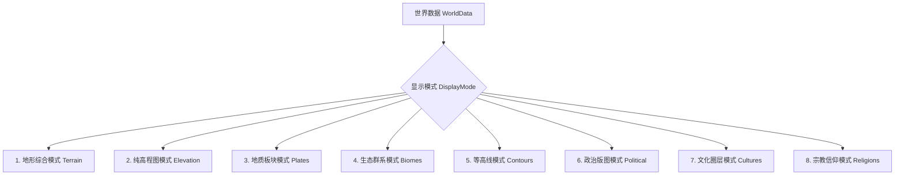

# 第 12 章 · 球面 3D WebGL 渲染与多层可视化

生成出的海量多维球面数据需要高效、美观地呈现给用户。本章深入探讨奇幻地图生成器的 3D 渲染引擎：如何基于 WebGL 自定义着色器管线，实现包含表面多边形网格、等高线带、平滑海岸线、自适应河网、矢量风场/洋流箭头以及光线投射拾取（Ray-Casting Picker）的完整可视化系统。

当前二维和三维视图均按图层懒构建并缓存几何，数据修改按生成阶段失效缓存。外观切换复用未失效资源，相机与数据静止时跳过 GPU 绘制和标签布局。生命周期、失效范围与性能边界见[实现记录](../generation-optimization.md)。

---

## 1. 3D 渲染管线与分层架构

地球的可视化呈现被划分为严格的深度分层渲染树：

```text
 ┌─────────────────────────────────────────────────────────────────────────────┐
 │                         3D Globe 渲染管线分层 Layering                      │
 └─────────────────────────────────────────────────────────────────────────────┘
  Layer 8: [3D 文本与地名层] ──► 国家名称曲面排版 / 城市地名与聚落图标 (Labels)
  Layer 7: [商贸与航线网络] ──► 海上跨海航运线 / 陆上商贸大动脉 (Trade Routes)
  Layer 6: [陆路交通道路网] ──► 城镇间陆路商道与干线公路网 (Road Routes)
  Layer 5: [矢量流动动态层] ──► 盛行风场流线 / 表层洋流切向箭头 (Vector Streamlines)
  Layer 4: [地表水系河流层] ──► 自适应宽度 3D 平滑河流几何带 (River Meshes)
  Layer 3: [地貌边界与海岸] ──► 平滑海岸线与内陆湖岸线轮廓 (Coastlines)
  Layer 2: [高程等高线带状] ──► 球面分级等高线网格 (Contours)
  Layer 1: [地表多边形网格] ──► 带有法线光照与高程位移的地表 (Surface Mesh)
  Layer 0: [底层水体球体层] ──► 无接缝底层海洋球体 (Stencil Base Sphere)
```

---

## 2. 地表多边形网格与 GPU 几何构造

每个球面 Voronoi 多边形单元（Region）由其中心点和外围角点（Corners）围成。

```text
                   Corner 1           Corner 2
                       *─────────────────*
                      / \               / \
                     /   \             /   \
                    /     \   Tri 1   /     \
                   /       \         /       \
                  /  Tri 5  \       /  Tri 2  \
                 *           \     /           * Corner 3
         Corner 5 \           \   /           /
                   \           \ /           /
                    \           ●           /
                     \       Region        /
                      \       Center      /
                       \     /     \     /
                        \   / Tri 4 \   /
                         \ /         \ /
                          *───────────*
                       Corner 4    Corner 3
```

### 2.1 扇形三角剖分（Fan Triangulation）
对于拥有 $K$ 个角点的多边形单元 $r$：
- 以中心点 $\mathbf{P}_r$ 为共同顶点，将其分割为 $K$ 个子三角形 $(\mathbf{P}_r, \mathbf{C}_i, \mathbf{C}_{i+1})$；
- 顶点属性打包：三维坐标 $[x, y, z]$、表面法线 $[n_x, n_y, n_z]$、顶点高程 $h$ 以及顶点 RGB 颜色。

### 2.2 顶点法线计算与光照模型
为了增强三维地形的立体感，顶点表面法线通过相邻多边形的高度差进行摄动，在 WebGL 片元着色器中应用 **朗伯漫反射（Lambertian Diffuse）与环境光遮蔽（AO）**：

$$I_{\text{diffuse}} = I_0 \cdot \max(0, \, \mathbf{n} \cdot \mathbf{L}) + I_{\text{ambient}}$$

- 迎光面山体明亮挺拔，背光面阴影深邃，极大地增强了山脉与峡谷的纵深感。

---

## 3. 海陆底图与 Stencil 掩码防穿模技术

在处理海陆交界与海岸线时，直接绘制陆地多边形常因浮点精度导致网格接缝处露底穿模。

系统设计了 **双层 Stencil 掩码与底色隔离技术**：
1. **底层水体球（Water Base）**：首先渲染一个连续完整的无接缝球面，填充海洋与深水颜色；
2. **上层陆地网格（Land Surface）**：仅对陆地单元（$\text{landMask} \neq 0$）进行高程位移与多边形着色覆盖；
3. 彻底消除了海岸线边缘的像素闪烁与接缝缝隙。

---

## 4. 专题显示模式着色器

系统支持一键无缝切换多种自然与人文地理专题模式：



- **地形模式（Terrain）**：深海深蓝 $\to$ 浅海碧蓝 $\to$ 沿海沙洲 $\to$ 低地生机绿 $\to$ 高原褐黄 $\to$ 极高山峰白雪；
- **高程模式（Elevation）**：经典地学光谱色带（Blue-Green-Yellow-Red-White）；
- **板块模式（Plates）**：按板块 ID 分配高对比度伪彩色，清晰展现板块轮廓与应力边界；
- **生态模式（Biomes）**：严格对应 20 种生物群系的代表性植被配色；
- **政治版图（Political）**：按国家政体着色，国界线高亮勾勒，未占领荒野保留中性灰调；
- **文化圈层（Cultures）**：展示主要文化圈分布范围与交界融合带；
- **宗教信仰（Religions）**：展示全球信仰版图与发源圣地标记。

---

## 5. 交通与贸易路线 3D 几何渲染

### 5.1 陆路道路几何（Road Geometry）
- 将多段线沿地形表面微小抬升（$\Delta r = +0.0015$），防止与地形 Z-fighting 穿模；
- 依据道路通行强度（`roadIntensity`）动态调节路面宽度与不透明度。

### 5.2 商贸与跨海航线几何（Trade Route Geometry）
- **海上大圆航线**：在两港口之间生成光滑的球面大圆弧线；
- **贸易运量映射**：根据路线运量（`routeVolume`）映射为流动光效或虚线脉冲动画。

---

## 6. 3D 球面地名标签与遮挡剔除 (GlobeLabelLayer)

为了在 3D 球面上呈现清晰美观的地名文字，系统设计了专用的 **球面 3D 标签图层**：

```text
 摄像机视角 Camera (位置 C, 朝向 D)
      \
       \   视线向量 View Vector
        \
         ▼
     ┌───────┐
     │ 地球  │  顶点法向 N · View > 0 ──► 背面自动剔除 (Back-face Culling)
     │ 球体  │  顶点法向 N · View ≤ 0 ──► 前景渲染，计算屏幕自适应投影与缩放
     └───────┘
```

1. **视线背面遮挡剔除（Horizon Culling）**：
   $$\mathbf{N}_{\text{label}} \cdot (\mathbf{P}_{\text{label}} - \mathbf{C}_{\text{camera}}) > 0$$
   转到地球背面的国家与城市标签被立即剔除，避免穿透球体显示；
2. **多级缩放自适应（LOD & Adaptive Font Scaling）**：
   - 远离地球时：仅显示主要大国全称与巨型都市名称；
   - 推进特写时：平滑淡入次级城镇、村庄、山脉与河流名称；
3. **曲面大字排版**：国家名称沿其领土主轴进行测地线曲线排列，呈现类似传统实体地球仪的典雅印刷质感。

---

## 7. 球面交互与光线投射拾取 (Ray-Casting Picker)

为了支持用户在 3D 地球上通过鼠标点击查看任意区域的详细地理信息，系统实现了高精度的 **球面光线投射拾取算法**：

```text
 摄像机视角 Camera (Origin O, 方向 D)
      \
       \   光线射线 Ray: R(t) = O + t*D
        \
         ▼
     ┌───────┐
     │ 地球  │ P = O + t_hit * D (球面相交点)
     │ 球体  │
     └───────┘
         │
         ▼
     利用空间局部邻域搜索最近的 Voronoi Region
```

1. **光线-球面求交（Ray-Sphere Intersection）**：
   $$(\mathbf{O} + t\mathbf{D}) \cdot (\mathbf{O} + t\mathbf{D}) = R^2 \implies a t^2 + b t + c = 0$$
   求出视线射向地球表面的最近交点三维坐标 $\mathbf{P}_{\text{hit}}$；
2. **最近区域搜索**：在网格中快速定位与 $\mathbf{P}_{\text{hit}}$ 点积最大的 Region 索引；
3. **多维全要素属性提取**：即时读取该单元的高程、气温、降水、径流、生物群系、聚落、交通、贸易、所属国家、文化圈与宗教信仰，实时反馈至 HUD 检查面板。
