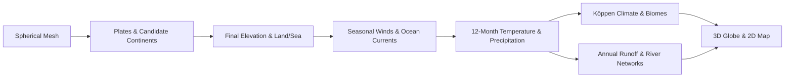

# Another Earth Generator Wiki

[English](./README.md) | [简体中文](./README.zh-CN.md)

This Wiki documents **what the current code has generated or displays**. Readers can first look at the "Intuitive Understanding" of each chapter, and then look at the algorithms and source code entry points when implementation details are needed. The natural laws in the text are the basis for modeling; specific values and outputs are subject to the linked source code.

| Order | Chapter | Questions answered after reading |
| --- | --- | --- |
| 01 | [System Architecture and Data Flow](01-system-architecture.md) | What stages generate the world? What results are shared on the sphere? |
| 02 | [Spherical Mesh and Topology](02-spherical-mesh.md) | How to divide the sphere into adjacent regions? How does resolution affect computation? |
| 03 | [Plate Motion and Tectonics](03-plate-tectonics.md) | Where do the tectonic clues for mountains, trenches, and faults come from? |
| 04 | [Landmasses, Coasts, and Islands](04-landmass-and-continents.md) | Why are candidate continents different from final land? |
| 05 | [Elevation and Topography](05-elevation-and-topography.md) | How to turn the tectonic skeleton into continuous terrain? |
| 06 | [Seasonal Winds and Surface Currents](06-seasonal-circulation.md) | What do the wind and current arrows, and the cold/warm indicators mean? |
| 07 | [Monthly Climate and Köppen Classification](07-atmosphere-and-climate.md) | How are 12-month temperature and precipitation generated? |
| 08 | [Runoff, Drainage, and River Networks](08-rivers-and-drainage.md) | How does rainwater converge into rivers along the sphere? |
| 09 | [Biomes and Ecosystems](09-biomes-and-ecosystems.md) | What temperature and humidity conditions correspond to forests, grasslands, deserts, and tundras? |
| 10 | [Rendering and Visualization](10-rendering-and-visualization.md) | How is the same world displayed as a globe and a map? |

## Generation Sequence at a Glance

**Quick Glossary:** A "region" is a Voronoi cell on the sphere; the "reference mesh" is used to stabilize large-scale plate layouts; the "output mesh" carries the final terrain and rivers; "seasonal anchors" are the four circulation fields for the spring equinox, summer solstice, autumn equinox, and winter solstice; the "monthly field" is the array of temperature and precipitation for each region from January to December.

## Model Boundaries

The current river network is an **annual average** network, and drainage depression filling only builds flow directions without forming visible lakes. The climate is a procedural generation model composed of empirical circulation, topography, and finite-step water vapor propagation. Ocean currents and SST cold/warm indicators are relative proxies, not solutions to the conservation equations for physical ocean current velocity or sea surface temperature. Ecology is a climate-driven classification result, without vegetation succession or food webs.
