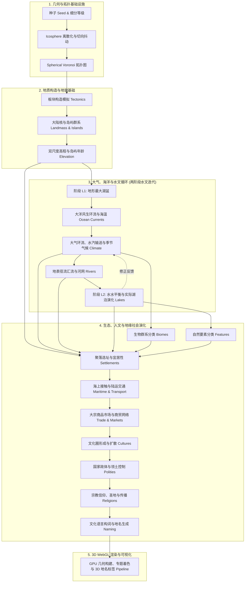

# 奇幻地图生成器：地球要素生成原理与方法 Wiki

欢迎阅读 **奇幻地图生成器 (Fantasy Map Generator)** 的底层原理与要素生成技术 Wiki。

当前实现变更见[生成、渲染与水文优化记录](../generation-optimization.md)，包含后台生成、图层缓存、参数单位迁移和模型边界。

本项目是一个基于物理与地理学规律、利用现代计算几何与过程生成技术（Procedural Generation）构建的确定性虚拟地球生成系统。系统以球面网格为唯一权威真源，自底向上模拟板块构造、大陆漂移、地形抬升、大洋环流、大气三圈环流与季节气候、水文水系演化、生态群系分布以及人类文明聚落的孕育，并提供高性能的 WebGL 3D 渲染与多维图层可视化。

---

## 知识库章节目录

| 章节编号 | 章节标题 | 核心内容提要 | 核心领域 / 职责 |
| :--- | :--- | :--- | :--- |
| **01** | [系统架构与球面数据流水线](./01-system-architecture.md) | 球面权威真源架构、生成流水线生命周期、连续内存布局与增量更新响应链 | 架构设计、数据流调度 |
| **02** | [球面几何离散化与网格拓扑](./02-spherical-mesh.md) | 正二十面体细分 (Icosphere)、随机抖动、Spherical Voronoi、对偶三角剖分与面积/距离度量 | 空间离散化、计算几何 |
| **03** | [板块构造与地质应力动力学](./03-plate-tectonics.md) | 最大最小距离种子选取、加权 Dijkstra 非均匀扩张、板块欧拉运动矢量与边界应力场分类 | 板块构造、地质动力学 |
| **04** | [大陆核与岛弧岛屿生成机制](./04-landmass-and-continents.md) | 陆地面积配额分配、板块走向拉伸轴生长、3D 噪声侵蚀、俯冲带火山岛弧与大洋热点链 | 大陆演化、岛弧岛链 |
| **05** | [高程建模与双尺度地貌生成](./05-elevation-and-topography.md) | 海岸距离场、造山带抬升与洋脊/海沟剖面、分形噪声调制、渲染高程与气候物理海拔双尺度体系 | 地形地貌、双尺度高程 |
| **06** | [风生大洋环流与海表温度传输](./06-ocean-currents-and-sst.md) | 盛行风应力驱动、科里奥利力偏转、海岸阻挡与滑移、图平流传热方程与海表温度 (SST) 距平 | 物理海洋、海温传输 |
| **07** | [三圈环流、水汽输送与季节性气候](./07-atmosphere-and-climate.md) | 气压带与风带、太阳辐射基准温与垂直递减率、水汽蒸发-平流输送、地形抬升降水、雨影效应与 12 个月动态 | 行星气候、大气循环 |
| **08** | [封闭湖盆、水水平衡与湖泊演化](./08-lakes-and-hydrology.md) | Priority-Flood 填洼分析、L1 地形湖盆、L2 气候水平衡（入流 vs 蒸发）、内流湖/外流湖、盐度与季节结冰 | 湖泊水文、水平衡迭代 |
| **09** | [地表径流汇流与河网系统](./09-rivers-and-drainage.md) | 无洼地排水表面、D8 坡度下降、沿径流汇流累积、河网阈值、穿湖流动、季节性断流与光滑几何曲线 | 地表水文、河网拓扑 |
| **10** | [生物群系与生态系统分类](./10-biomes-and-ecosystems.md) | 增强型 Whittaker 生态模型、温湿二维空间划分、高山林线与垂直自然带谱、20 类细分生态群落 | 生态地理、植被分类 |
| **11** | [人文地理、地缘网络与社会演化](./11-human-geography.md) | 综合宜居性场、聚落选址、海上接触与陆运网络、大宗商品贸易、文化扩散、国家领土、宗教信仰与语言地名 | 人文地理、地缘政治 |
| **12** | [球面 3D WebGL 渲染与多层可视化](./12-rendering-and-visualization.md) | 3D 渲染架构、多边形/等高线/河流/道路/商贸航线 GPU 几何、政治/文化/宗教模式、动态 3D 地名标签 | 图形渲染、多层可视化 |

---

## 全球要素生成流水线总览

系统各要素按照严格的物理因果与社会演化顺序链式生成：

---

## 核心设计哲学

1. **球面第一原则 (Sphere as Single Source of Truth)**：世界生成彻底摆脱二维矩形边界，高程、气压、水汽和温度均定义在单位球面 $S^2$ 上，消除地图边界与经度经线伪影。
2. **确定性过程生成 (Deterministic Procedural Generation)**：给定唯一的数值种子（`seed`）与参数集，利用伪随机数发生器（Alea）与 3D Simplex 噪声，保证每次生成的星球完全一致。
3. **物理与地理自洽 (Physical Self-Consistency)**：山脉由板块碰撞抬升产生，暖流沿海岸前进提升沿岸降水，迎风坡形成丰沛降水并造就背风坡雨影荒漠，河网汇流雕琢地形，聚落自然依水而建。
4. **连续数组布局 (TypedArray Cache Locality)**：区域与顶点数值字段主要使用 TypedArray，湖泊库容使用 `Float64Array`。生成在 Worker 中运行，并按参数依赖增量重算；实际耗时和内存开销需要按网格规模测量。
