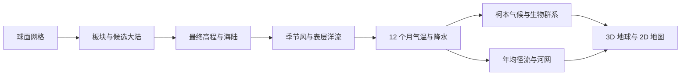

# 自然领域 · 另一个地球生成器 Wiki

[English](./README.md) | [简体中文](./README.zh-CN.md)

本 Wiki 记录**当前代码已经生成或显示的内容**。读者可以先看每章的“直观理解”，需要实现细节时再看算法和源码入口。文中的自然规律是建模依据；具体数值和输出以所链接的源码为准。

| 顺序 | 章节 | 读完能回答的问题 |
| --- | --- | --- |
| 01 | [系统架构与数据流](01-system-architecture.zh-CN.md) | 世界由哪些阶段生成？哪些结果在球面上共享？ |
| 02 | [球面网格与拓扑](02-spherical-mesh.zh-CN.md) | 怎样把球面分成相邻区域？分辨率如何影响计算？ |
| 03 | [板块运动与构造](03-plate-tectonics.zh-CN.md) | 山脉、海沟与断层的构造线索来自哪里？ |
| 04 | [大陆、海岸与岛屿](04-landmass-and-continents.zh-CN.md) | 候选大陆与最终陆地为何不同？ |
| 05 | [高程与地貌](05-elevation-and-topography.zh-CN.md) | 如何把构造骨架变成连续地形？ |
| 06 | [季节风与表层洋流](06-seasonal-circulation.zh-CN.md) | 风和洋流箭头、冷暖指标表示什么？ |
| 07 | [逐月气候与柯本分类](07-atmosphere-and-climate.zh-CN.md) | 12 个月气温和降水如何生成？ |
| 08 | [径流、排水与河网](08-rivers-and-drainage.zh-CN.md) | 雨水怎样沿球面汇成河？ |
| 09 | [生物群系](09-biomes-and-ecosystems.zh-CN.md) | 哪些温湿条件对应森林、草原、荒漠和苔原？ |
| 10 | [渲染与交互](10-rendering-and-visualization.zh-CN.md) | 同一份世界如何显示为地球和地图？ |

## 一眼看懂生成顺序

**术语速查：**“区域”是球面上的一个 Voronoi 单元；“参考网格”用来稳定大尺度板块布局；“输出网格”承载最终地形与河流；“季节锚点”是春分、夏至、秋分和冬至的四组环流场；“月度场”是 1–12 月各区域的气温与降水数组。

## 模型边界

当前河网是**年均**河网，排水填洼只构建流向，不形成可见湖泊。气候是由经验环流、地形和有限步数水汽传播组成的过程生成模型。洋流与海温冷暖指标是相对代理量，没有求解物理海流速度或海表温度的守恒方程。生态是气候驱动的分类结果，没有植被演替或食物网。
