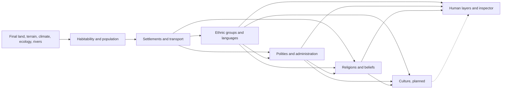

# Society · Another Earth Generator Wiki

[English](./README.md) | [简体中文](./README.zh-CN.md) | [Wiki index](../README.md)

**Status: first five stages implemented.** After hydrology, the Worker generates population, settlements, transport, market access, ethnicity, languages, polities, first-level districts, and primary belief affiliation. Their base maps, overlays, inspector, and resident statistics are available. Culture remains a design proposal; source code is authoritative for numerical parameters. See the [Nature Wiki](../nature/README.md) for natural-world behavior.

| Order | Chapter | Question answered |
| --- | --- | --- |
| 01 | [Architecture and Data Contracts](01-system-architecture.md) | Where do human stages join the spherical pipeline, and which arrays own the data? |
| 02 | [Population, Habitability, and Settlements](02-population-and-settlements.md) | Why do people live here, and what supports a city's size? |
| 03 | [Transport and Spatial Economy](03-transport-and-economy.md) | How do roads, ports, and city hinterlands form? |
| 04 | [Ethnic Groups and Languages](04-ethnic-groups-and-languages.md) | How are origins, migration, mixed communities, and cross-border groups represented? |
| 05 | [Polities and Administration](05-polities-and-administration.md) | How do political centers govern territory, and why do borders differ from ethnic boundaries? |
| 06 | [Religions and Beliefs](06-religions-and-beliefs.md) | How does faith spread through networks and coexist within a region? |
| 07 | [Cultures and Cultural Regions](07-cultures-and-regions.md) | What does culture show beyond ethnicity and religion? |
| 08 | [History and Determinism](08-history-and-determinism.md) | How can events shape the present while keeping seeded results reproducible? |
| 09 | [Rendering, Interaction, and Statistics](09-rendering-and-interaction.md) | How do human base maps, overlays, picking, and the inspector work together? |

## Generation order

**Terms:** A *region* is one cell of the output spherical mesh. *Population composition* stores resident groups in each area. A *leading group* is merely the largest share shown on the map; it need not exceed half the population. A *polity* describes governance, while ethnicity, religion, and culture are separate dimensions.

## Scope

The first release should generate one deterministic world snapshot with an agricultural society and travel mostly by foot or draft animals. Population figures are model estimates, not real-world forecasts. Current hydrology provides annual rivers but no visible lakes or monthly navigability; roads and ports must respect those limits. Timelines, warfare, trade volumes, and multiple simultaneous belief affiliations can follow after the snapshot is stable.
