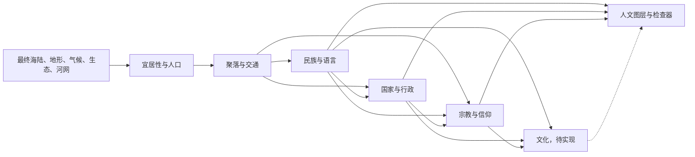

# 人文领域 · 另一个地球生成器 Wiki

[English](./README.md) | [简体中文](./README.zh-CN.md) | [Wiki 总目录](../README.zh-CN.md)

**状态：前五阶段已实现。** Worker 在水文阶段后依次生成人口、聚落、交通、市场可达性、民族与语言、国家与行政区、宗教与信仰；提供对应底图、叠加层、检查器和人口统计。文化章节仍是设计方案；具体数值参数以源码为准。已实现的自然系统见[自然领域 Wiki](../nature/README.zh-CN.md)。

| 顺序 | 章节 | 读完能回答的问题 |
| --- | --- | --- |
| 01 | [系统架构与数据契约](01-system-architecture.zh-CN.md) | 人文数据怎样接在球面流水线后，哪些数组是权威真源？ |
| 02 | [人口、宜居性与聚落](02-population-and-settlements.zh-CN.md) | 为什么有人住在这里，城市规模从哪里来？ |
| 03 | [交通与空间经济](03-transport-and-economy.zh-CN.md) | 道路、港口和城市腹地怎样形成？ |
| 04 | [民族与语言](04-ethnic-groups-and-languages.zh-CN.md) | 如何表达起源、迁徙、混居和跨国民族？ |
| 05 | [国家与行政](05-polities-and-administration.zh-CN.md) | 政治中心如何控制领土，边境为何不等于民族边界？ |
| 06 | [宗教与信仰](06-religions-and-beliefs.zh-CN.md) | 信仰怎样跨交通网传播并在同一地区共存？ |
| 07 | [文化区与特征](07-cultures-and-regions.zh-CN.md) | 文化图层提供什么与民族、宗教不同的信息？ |
| 08 | [历史与确定性](08-history-and-determinism.zh-CN.md) | 历史事件如何改变当前世界，同时保持相同种子可复现？ |
| 09 | [渲染、交互与统计](09-rendering-and-interaction.zh-CN.md) | 人文底图、叠加层、拾取和检查器如何协作？ |

## 生成顺序

**约定：**“区域”是输出球面网格的一个单元；“人口构成”是按地区保存的居民群体数据；“主要群体”只是地图显示中占比最大的群体，不一定超过半数；“国家／政体”描述治理关系，民族、宗教与文化是独立维度。

## 实施边界

第一版建议生成确定性的单一世界快照，默认采用农业社会与步行、畜力交通的技术背景。所有人口数字是模型估算，不代表真实世界的人口预测。当前水文只有年尺度河网，没有可见湖泊或逐月河流通航数据；道路与港口必须按这些数据限制建模。时间轴、战争、贸易流量和多重信仰参与可在基础快照稳定后扩展。
